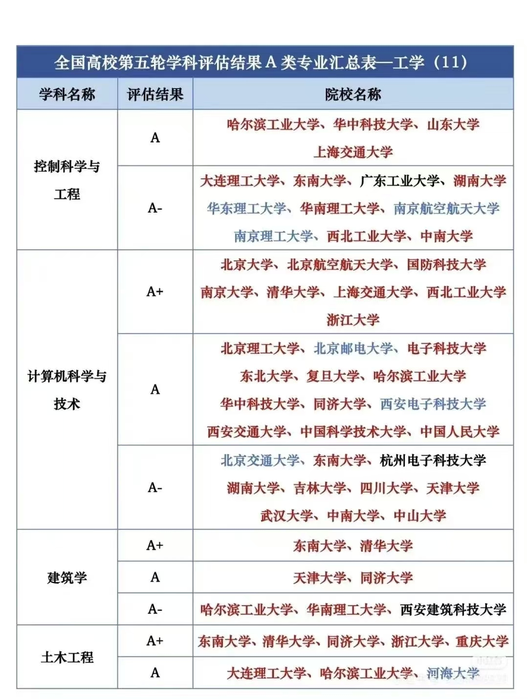
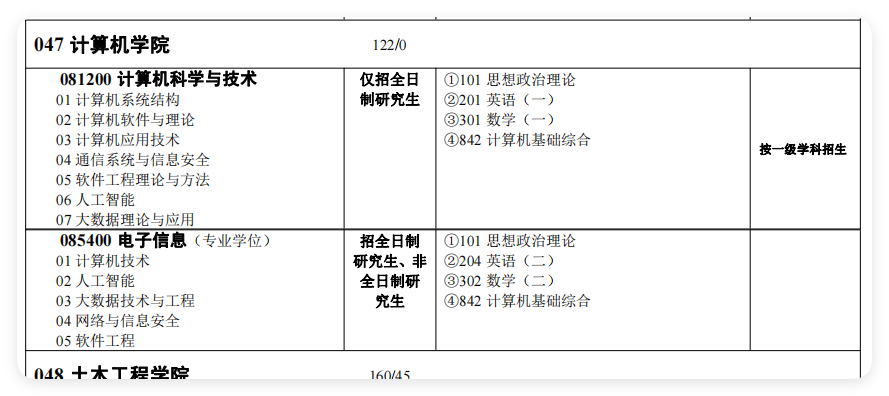
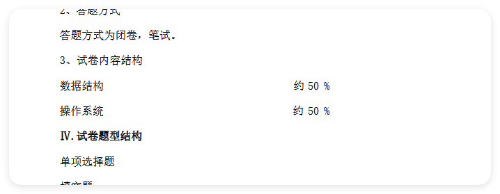
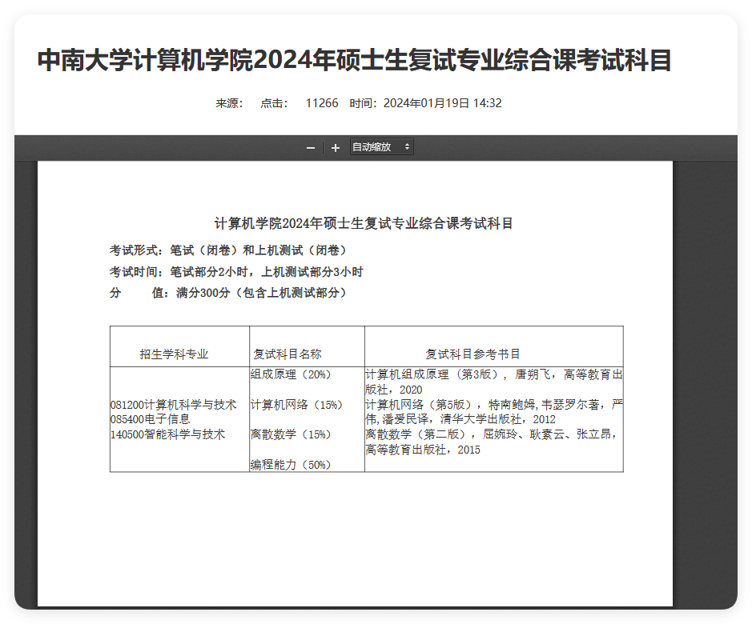

- [ ] 完成词条展示界面
今天了解了一下考研的事情，目前我发现自己能做的事情有：
- [ ] 记单词
- [ ] 复习高等数学

英语和高等数学是必须要考的，目前的考研对象有两个，一个是杭电的计算机科学与技术，第二个是湖南大学的计算机科学与技术。杭电的计科是考的408（计算机操作系统、计算机组成原理、数据结构、计算机网络）。而湖南大学的计科考的668数据结构，复试中有上机考试，然后笔试考
[25计算机考研院校数据分析 \| 湖南大学\_湖南大学计算机2025年报考人数-CSDN博客](https://blog.csdn.net/m0_72717598/article/details/138289718)
[Site Unreachable](https://zhuanlan.zhihu.com/p/652995278?utm_psn=1854621649569193984)
中南大学考研
初试：

复试：
