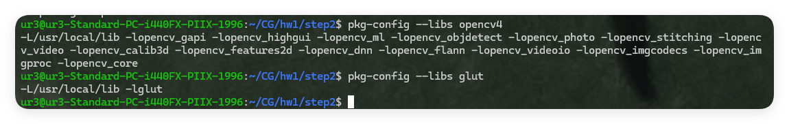

# 前言
2025-02-27 06:42:27
时隔一年，我再次重拾计算机图形学，内心怀揣着激动。面试官的一言，让我又燃起了对渲染的渴望。借着计算机图形学课程的机会，我想要重新认识一下这些经典的算法，并花一个学期的时间，编写一个软渲染的管线。我非常感谢字节的面试官。是他让我看到了工业界对渲染的需求，也让我再次燃起了大一刚学习图形学时的激情。

首先在开始前，明确一下我的测试环境。我使用的是Ubuntu22.04进行下面的流程测试。

# 依赖下载
首先我们安装一些必须的依赖，方便我们自己编译freeglut和opencv。
```bash
sudo apt update
sudo apt install cmake g++ gcc pkg-config build-essential unzip
```
然后我们可以前往[freeglut官网](https://freeglut.sourceforge.net/)和[opencv官网](https://opencv.org/releases/)找到它们的发行版本，直接下载源码即可。测试使用的版本如下：

- * OpenCV – 4.11.0
- freeglut - 3.6.0
```bash
wget https://github.com/opencv/opencv/archive/refs/tags/4.11.0.zip
wget https://github.com/freeglut/freeglut/releases/download/v3.6.0/freeglut-3.6.0.tar.gz
# 解压
unzip 4.11.0.zip
tar -xvf freeglut-3.6.0.tar.gz
```

# 编译glut和opencv
## glut
```bash
cd freeglut-3.6.0
cmake -S . -B build
cd build
make -j56
sudo make install
```
这里记住安装的路径，一般为`/usr/local/lib/`。

## opencv
```bash
cd opencv-4.11.0
cmake -S . -B build
cd build
make -j56
sudo make install
```

## 配置pkg-config
编译并安装好动态/静态库后，我们要配置pkg-config的索引，前面的依赖安装中安装了`pkg-config`，你可以用这个测试它：
```bash
echo $PKG_CONFIG_PATH
```
有可能这个变量是空的，我们主要通过设置这个环境变量来添加pkg索引。你可以在任何你熟悉的地方编写环境变量的加载，这里我们使用profile.d/来添加。
```bash
touch /etc/profile/pkgconfig.sh
vim !$
```
将`export PKG_CONFIG_PATH=/usr/local/lib/pkgconfig:$PKG_CONFIG_PATH`加入该文件的最后一行。然后检查自己的库是否能被索引到：
```bash
pkg-config --libs opencv4
pkg-config --libs glut
```
类似的输出是正确的：


## 配置ld
然后我们需要为两个库编写ld conf。
```bash
sudo vim /etc/ld.so.conf.d/glut.conf
sudo vim /etc/ld.so.conf.d/opencv4.conf
```
最后重新载入
```bash
sudo ldconfig
```
两个文件都只需要写入`/usr/local/lib`即可。
# CMakeLists.txt

这里使用了头歌上的两个简单的绘制代码来测试我们最后的环境：
## student.h
```cpp
// student.h
#include <GL/freeglut.h>
void myDisplay(void)
{

        // 请在此添加代码，调用glClearColor函数
    /********** Begin *********/


    /********** End **********/
        glClear(GL_COLOR_BUFFER_BIT);
        // 请在此添加代码，实现其他渲染功能
    /********** Begin *********/
                                        //设置长方形颜色
                                        //设置长方形位置
                                        //将图形类型选定为三角形GL_TRIANGLES
                                        //设置三角形顶点颜色和位置
                                        //设置三角形顶点颜色和位置
                                        //设置三角形顶点颜色和位置
                                        //调用glEnd
                                        //设置渲染点直径
                                        //将图形类型选定为点GL_POINTS
                                        //设置渲染点颜色和位置
                                        //设置渲染点颜色和位置
                                        //设置渲染点颜色和位置
                                        //调用glEnd


    /********** End **********/

        glFlush();
}
```

## test.cpp
```cpp
//test.cpp
// 提示：写完代码请保存之后再进行评测
#include <GL/freeglut.h>

#include<stdio.h>

// 评测代码所用头文件-开始
#include<opencv2/core/core.hpp>

#include<opencv2/highgui/highgui.hpp>

#include<opencv2/imgproc/imgproc.hpp>
 // 评测代码所用头文件-结束
/*
(2).绘制一个矩形，颜色为(1.0f,1.0f,1.0f)，矩阵位置（-0.5f，-0.5f，0.5f，0.5f)；
(3).绘制一个三角形，三个顶点颜色分别为（1.0f, 0.0f, 0.0f), (0.0f,1.0f,0.0f)， (0.0f,0.0f,1.0f)，对应的顶点坐标分别为(0.0f,1.0f), (0.8f,-0.5f),  (-0.8f,-0.5f)；
(4).绘制三个直径为3的点，颜色为（1.0f, 0.0f, 0.0f)， (0.0f,1.0f,0.0f)， (0.0f,0.0f,1.0f)，对应的顶点坐标分别为（-0.4f,-0.4f), (0.0f,0.0f)，(0.4f,0.4f)。
*/
void myDisplay(void) {
  // 请在此添加你的代码
  /********** Begin ********/
  glClearColor(0.0f, 0.0f, 0.0f, 0.0f);
  glClear(GL_COLOR_BUFFER_BIT);
        glPointSize(1);
  glBegin(GL_QUADS);
  glColor3f(1.0f, 1.0f, 1.0f);
  glVertex2f(-0.5f,-0.5f);
        glVertex2f(-0.5f,0.5f);
        glVertex2f(0.5f,0.5f);
        glVertex2f(0.5f,-0.5f);
  glEnd();

  glBegin(GL_TRIANGLES);
  glColor3f(1.0f,0.0f,0.0f);
        glVertex2f(0.0f,1.0f);

        glColor3f(0.0f,1.0f,0.0f);
        glVertex2f(0.8f,-0.5f);

        glColor3f(0.0f, 0.0f, 1.0f);
        glVertex2f(-0.8f,-0.5f);
  glEnd();

        glPointSize(3);
  glBegin(GL_POINTS);
  glColor3f(1.0f, 0.0f, 0.0f);
  glVertex2f(-0.4f, -0.4f);
  glColor3f(0.0f, 1.0f, 0.0f);
  glVertex2f(0.0f, 0.0f);
  glColor3f(0.0f, 0.0f, 1.0f);
  glVertex2f(0.4f, 0.4f);
  glEnd();

  /********** End **********/

  glFlush();
}

int main(int argc, char * argv[]) {

  glutInit( & argc, argv);
  glutInitWindowPosition(100, 100);
  glutInitWindowSize(400, 400);
  glutCreateWindow("Hello Point!");
  glutDisplayFunc( & myDisplay);
  glutMainLoopEvent();

  /*************以下为评测代码，与本次实验内容无关，请勿修改**************/
  GLubyte * pPixelData = (GLubyte * ) malloc(400 * 400 * 3); //分配内存
  GLint viewport[4] = {
    0
  };
  glReadBuffer(GL_FRONT);
  glPixelStorei(GL_UNPACK_ALIGNMENT, 4);
  glGetIntegerv(GL_VIEWPORT, viewport);
  glReadPixels(viewport[0], viewport[1], viewport[2], viewport[3], GL_RGB, GL_UNSIGNED_BYTE, pPixelData);

  cv::Mat img;
  std::vector < cv::Mat > imgPlanes;
  img.create(400, 400, CV_8UC3);
  cv::split(img, imgPlanes);

  for (int i = 0; i < 400; i++) {
    unsigned char * plane0Ptr = imgPlanes[0].ptr < unsigned char > (i);
    unsigned char * plane1Ptr = imgPlanes[1].ptr < unsigned char > (i);
    unsigned char * plane2Ptr = imgPlanes[2].ptr < unsigned char > (i);
    for (int j = 0; j < 400; j++) {
      int k = 3 * (i * 400 + j);
      plane2Ptr[j] = pPixelData[k];
      plane1Ptr[j] = pPixelData[k + 1];
      plane0Ptr[j] = pPixelData[k + 2];
    }
  }
  cv::merge(imgPlanes, img);
  cv::flip(img, img, 0);
  cv::namedWindow("openglGrab");
  cv::imshow("openglGrab", img);
  //cv::waitKey();
  cv::imwrite("../img_step2/test.jpg", img);
  return 0;
}
```

## CMakeLists.txt

```cmake
cmake_minimum_required(VERSION 3.1)
project(StartGLUT)

find_package(OpenCV REQUIRED)
find_package(OpenGL REQUIRED)
find_package(GLUT REQUIRED)

set(CMAKE_CXX_STANDARD 11)
set(CMAKE_CXX_STANDARD_REQUIRED TRUE)

include_directories($(OpenCV_INCLUDE_DIRS))
include_directories($(OpenGL_INCLUDE_DIRS))
include_directories($(GLUT_INCLUDE_DIRS))

add_executable(${PROJECT_NAME} test2.cpp student.h)

target_link_libraries(${PROJECT_NAME} ${OPENGL_LIBRARIES} ${GLUT_LIBRARIES} ${OpenCV_LIBRARIES})
```

## 编译
```bash
cmake -S . -B build
cd build
make
./StartGLUT
```