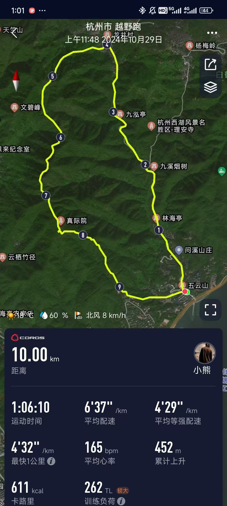

# 说明

杭州电子科技大学定向越野队新生选拔赛预计于2024.11.10（周日）举行，有资格参与选拔的同学为2024新生杯男子组和女子组前八名的同学。此次选拔预计选出四名同学进入定向队，其中至少包含一名女生。

# 比赛路线

本次比赛使用“九溪十八涧”路线，起点为九溪公交站台，绕路线逆时针一圈结束。途经陈布雷墓、陈三立墓、林海亭、九溪烟树、百世美茗茶园、九泓亭、十里锒铛、西山游步道、瞭望亭、五云山、真际寺……最终回到九溪公交站。全长约10km，总爬升440m左右，该路线运动强度大。

# 比赛规则

所有选手自由选择补给配置，男女同时出发，成绩以运动记录为准。

建议补给与装备为

- 250ml纯净水
- 轻便运动服
- 防滑运动鞋

不建议带太多东西，山脚下有存包的设备，我们尽量为大家配备对讲机。

男生预期完赛时间为90分钟，女生不详。