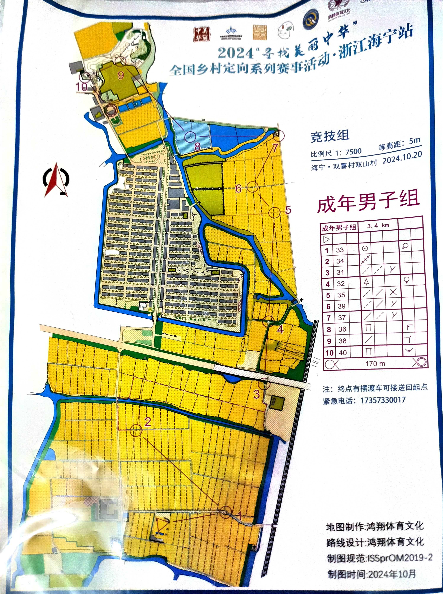
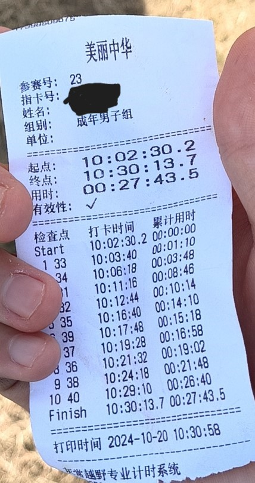
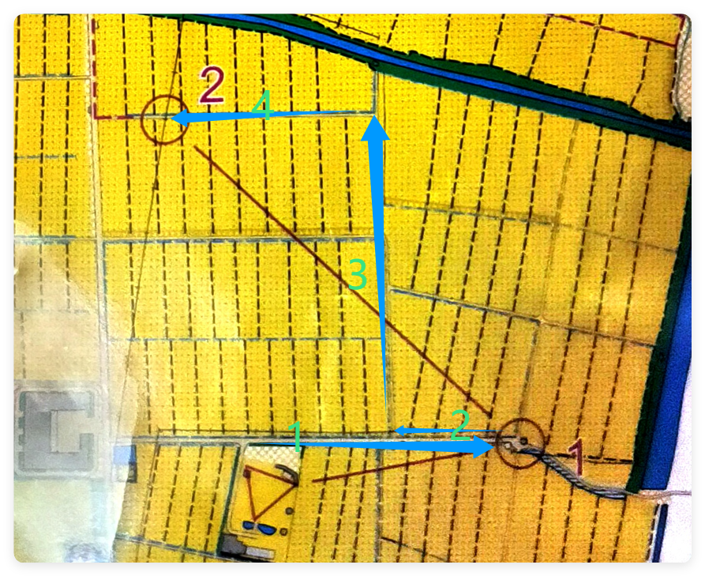
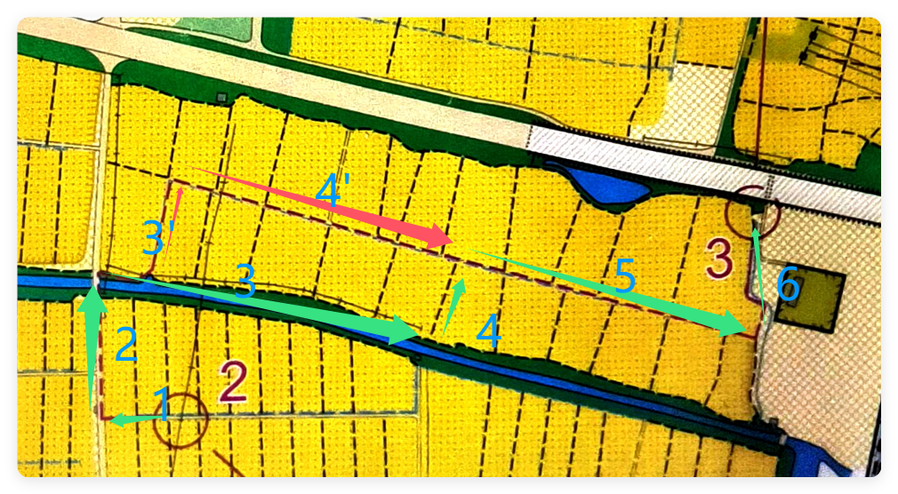
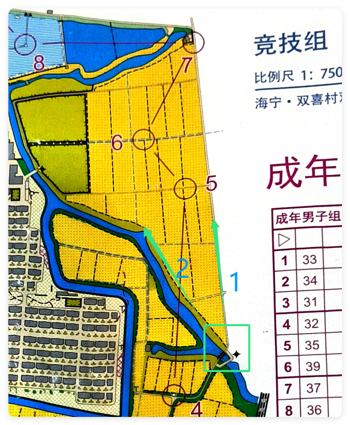
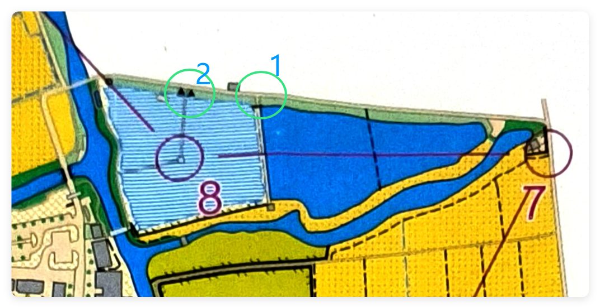
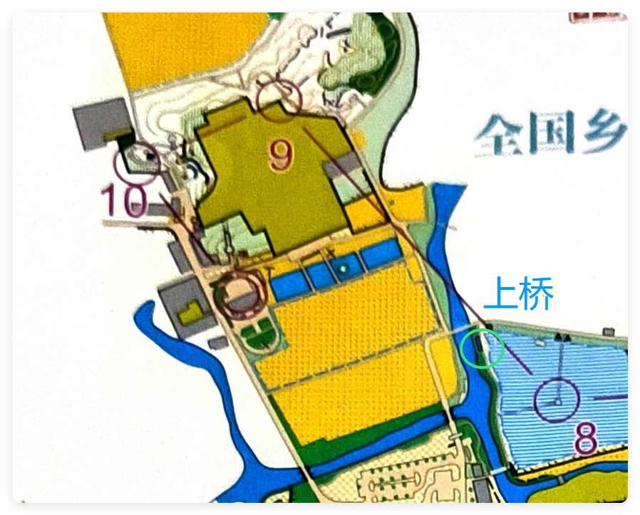
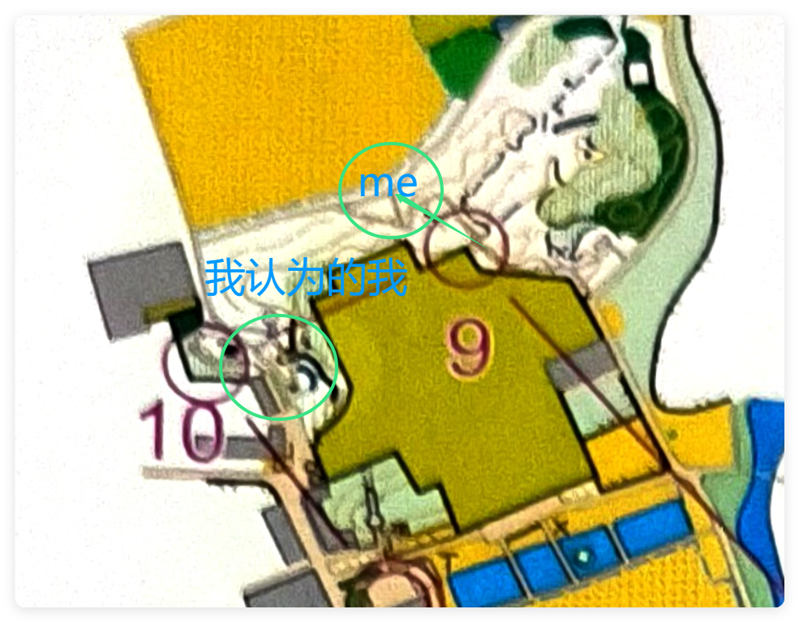

今天杭电定向队五人小队来到了海宁，准备参加本次乡村定向系列赛事——海宁站。去年其实已经来过一次海宁比赛了，但是当时我没有写博客的习惯，其实很大程度上丢失了很多回忆。那时外面只有三个人，还下着雨跑完了难度相当高的一张图。而今年这次的图就相对简单了很多，不仅距离近了，而且没有上山的路，所有点位也基本不会跑回头路，让我跑的非常舒服。
这次比赛的地图：

最后成绩：

## 复盘
出门很顺利，1、2点打下来都没有任何问题，路线也是我认为最合理的：

但是到了第三个点这里救有一个小失误了，我走的是123456，而3这段路是一条非常小的田里，几乎没有路可以走。而相邻的是一条非常大的田艮，我在田里跑了一段路之后发现不对才重新向北跑到5段上去。这里损失了大概30s。

3号点到4号点没问题，正常从下方穿过天桥就能过去，然后从4号点到5号点是本场第一个技术失误，穿过这个桥，来到一条大路上，我没有发现左手边的河已经不见了，我一直以为我在往2方向走，导致我最后找五号点的时候跑到场外去了，这里是一个非常严重的技术问题，这里浪费了很多时间。保守估计30s吧。5号点到6号点直接穿田而过，速度非常快。7号点页很好找，在路的拐角处。

后面的8号点在一个水中的亭子中，我跑到两个湖的分割线的时候有点恍惚，以为已经到了圈2的位置，不过没有耽误什么时间，一下反应过来就接着打完了8号点。

然后在上桥之前遇到了祝队，后面正常打到9号点。

最后就是本场比赛最大的失误点了，9号点打完，我接着绕这个房子跑，但是我，以为我已经到了房子的西边，而且！而且！！我没带指北针，但凡我这里看一眼指北针，我都知道在的不是一条南北走向的路，而是东西走向，我就这么水灵灵地，朝着东边跑了五分钟，最后被祝队追上，才意识到自己走错了，打完10号点直奔终点结束比赛。这里至少浪费了我4分钟啊，四分钟。比赛结束了第一名22分钟，我跑了27分钟，要是这里没跑错真有可能站台啊，呜呜呜。还是得多练。这里算是依次大遗憾了吧。

## 夸奖
这个图画的蛮好的，没有太多回头路，点位设计合理，人也不会很挤，前后没人的时候占大多时间，我喜欢这样的比赛，跑在规划好的路上，然后思考下一个点位该如何跑。人在路上，脑子也在路上。<h3>定位、定向、导航、奔跑。</h3>这四件事情非常的令人着迷，这就是定向的魅力。尤其是导航这块，路线的规划，扶手的选择，图例的解析。跃然纸上、动于天地。此乃定向越野运动。

