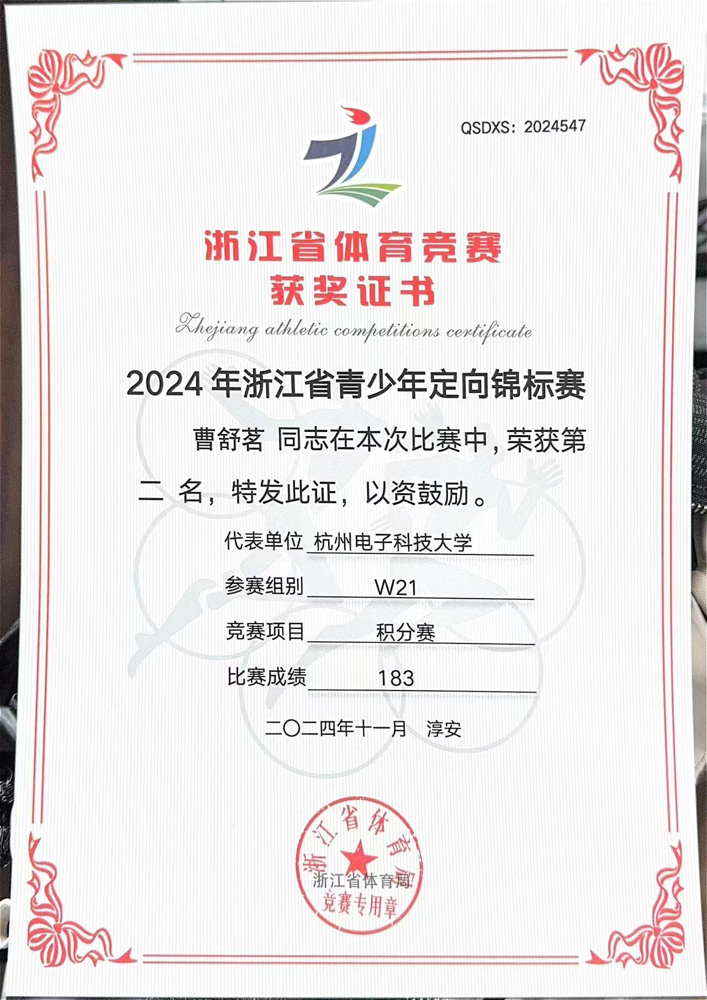
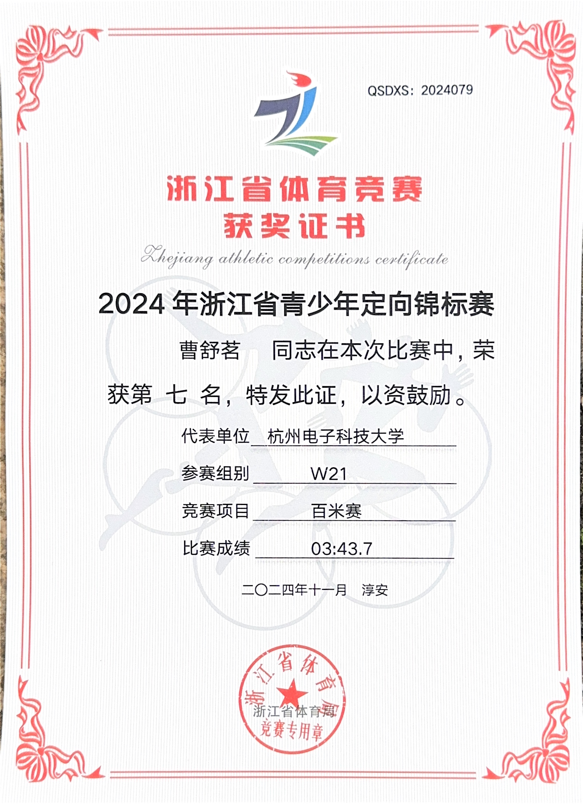
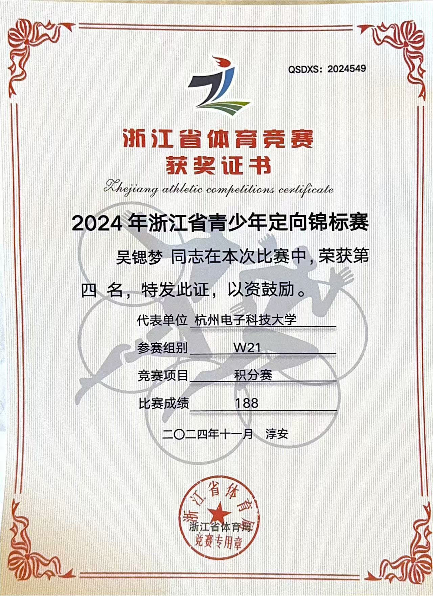
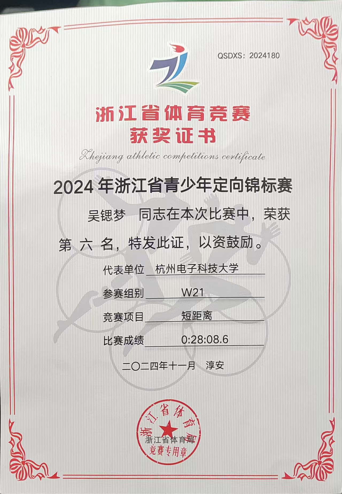
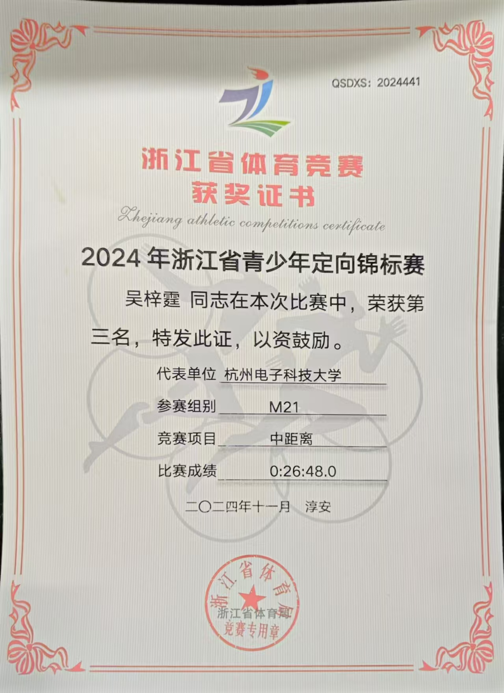

# 2024浙江省青少年定向锦标赛

  

杭州电子科技大学定向越野队，经历了长达五年的大低谷。19、20、21、22、23。整整五年没有任何省级及以上的比赛。

疫情对定向运动的是毁灭性的。19、20、21和22年春天，都是在疫情爆发或封锁阶段。任何户外比赛都不可能举办，随着比赛消失的还有队员的训练、队员的实力、比赛的评级。

当22年秋天，疫情解封时，杭电也迎来了一场定向校赛。可惜的是没有任何一名新队员接触过定向比赛，但是金益群队长并没有放弃，每周训练，从未无故停训。

没有任何参赛经验是非常可怕的事情，以至于到了23年金队长退役之后新上任的张慧源队长不知道如何给队员训练。体能训练是23级队员练的最多的东西。

因为没有比赛，杭电体育部也取消定向队的训练津贴。好在我们撑过来了，24年是神奇的一年，我们引来了两位希望之光——吴梓霆和曹舒茗。

吴梓霆是越野好手，方向感极强，路跑半马大众精英运动员、曹舒茗从小参加定向越野比赛，曾获2019杭州市中学生定向赛积分女子甲组第六、2020杭州市中学生定向赛积分女子甲组第一、2020杭州市中学生定向赛百米第六、2020年省赛M16短距第三、2021杭州市中学生定向赛积分女子甲组第八。

张队和祝队商量过后，向朱老师提出了参加本次省赛的决定。列出一个节俭的预算表后，朱老师向体育部发去了申请。可惜被驳回了，给出的理由是本次比赛没有教育局的参与。

但是我们没有放弃，打算自费参加本次比赛。这时朱老师站了出来，帮我们扫平了前方的障碍：为我们支付了比赛的报名费和路费，为我们打通了体育部的参赛许可。接下来便是体检、盖章、保险、承诺书以及————比赛！

为了节省预算，我们没有报名第一天的接力赛（需要三个同组别的选手），两名队员第一天到达，参加了领队会议和第二天的百米赛。两名队员第二天到达，参加第三天的短距比赛，最后一名队员第三天到达，直奔赛场参加比赛。最后大家一起参加中距/积分赛。

第二天的百米赛，曹舒茗同学开门大吉，拿到了W21组百米赛的第七名；第三天吴锶梦同学拿下W21组短距赛的第六名；第四天吴梓霆同学拿下了M21组中距赛的第三名！曹舒茗同学拿下了W21组积分赛的第二名！吴锶梦同学拿下W21组积分赛的第四名！

这次比赛，我们背水一战、这场比赛，我们孤注一掷、这场比赛，我们决定生死！

定向队！活下来了！

