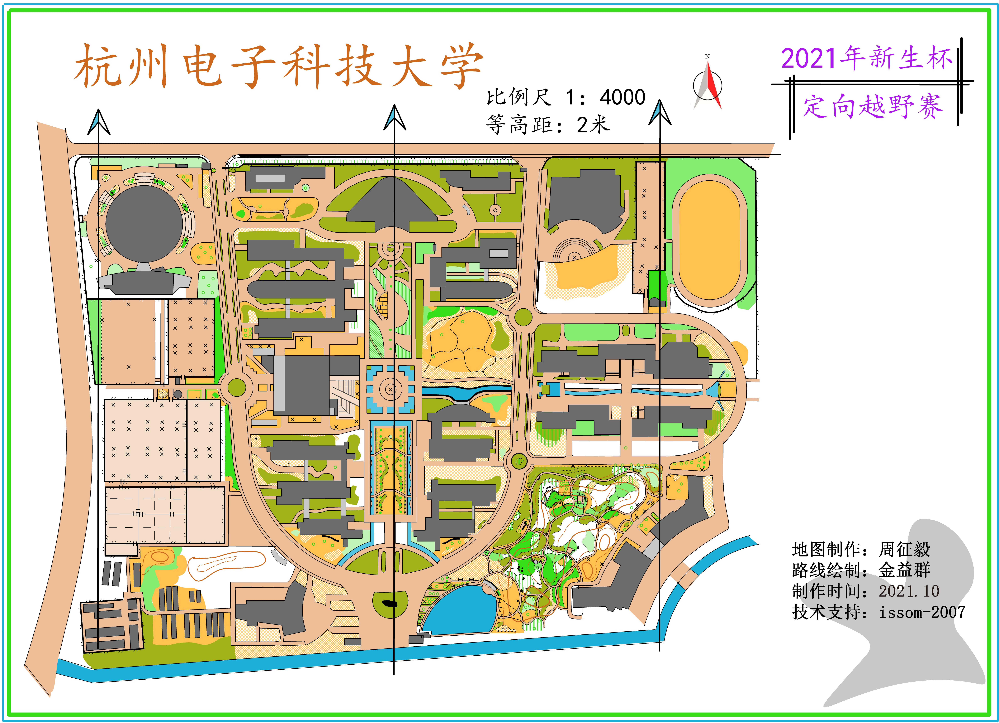
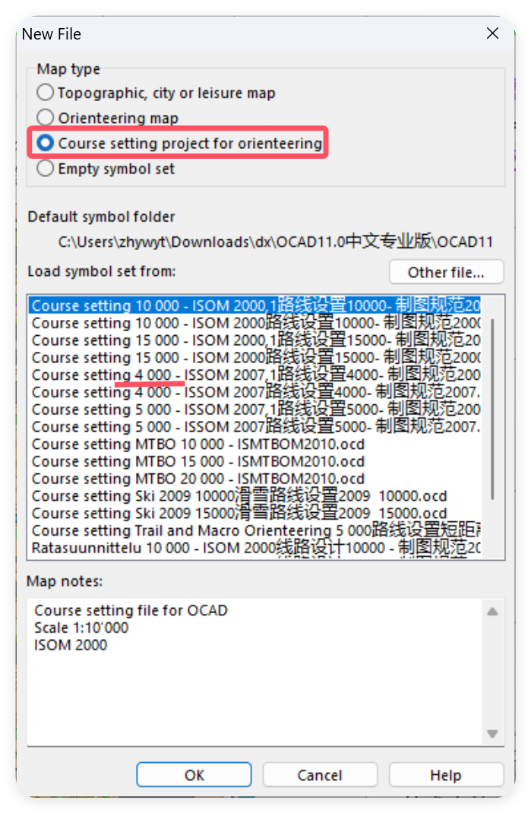
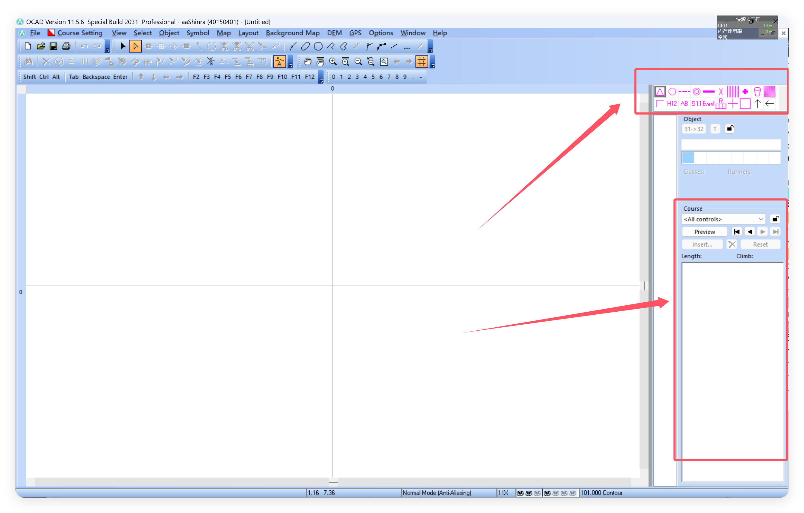
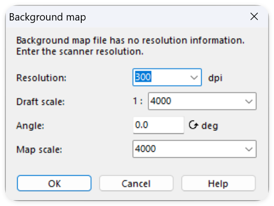
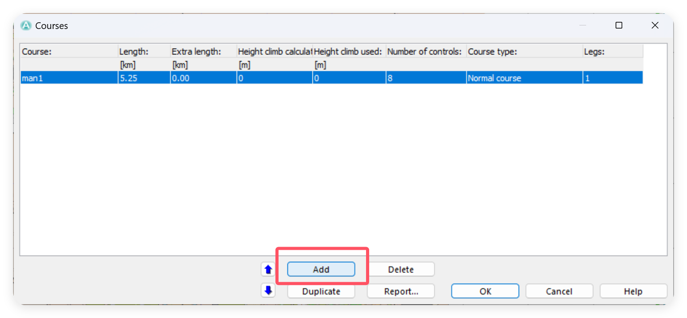
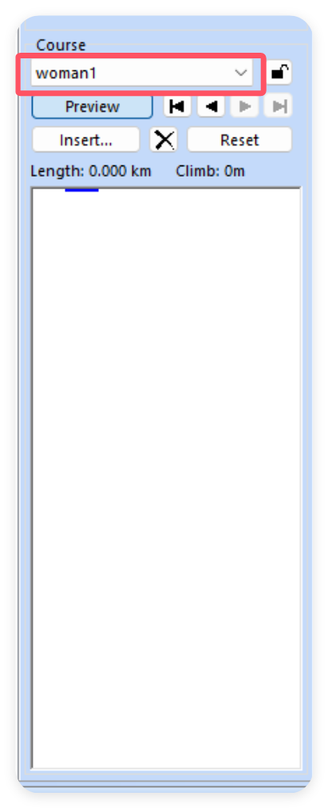
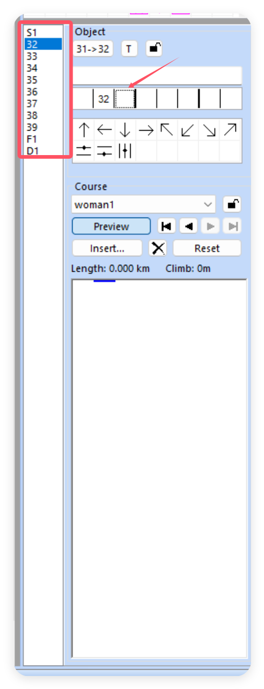

首先是物资准备：
- OCAD软件
- 定向底图
这两个请找你的队长获取，或者在这里有一个链接，仅供学习使用：
[OCAD专业版](http://alit.zhywyt.me/d/HDUDX/%E4%BC%A0%E5%AE%B6%E5%AE%9D/%E5%AE%9A%E5%90%91%E8%BD%AF%E4%BB%B6%E4%B8%8E%E5%9C%B0%E5%9B%BE/OCAD11.0%E4%B8%AD%E6%96%87%E4%B8%93%E4%B8%9A%E7%89%88.rar?sign=J5AeDYm7k15QPbKk6-s707wJnsQklOLykvI0ov4adeY=:0)
这个链接不定时失效。

## 检查地图比例尺
首先查看自己的底图：

你需要注意的是比例尺，这里我们的地图比例尺是1：4000，我们需要根据这个来创建我们的项目。
## 创建路线项目
打开我们的OCAD，这个过程会比较缓慢（由于软件比较老了，但是它老而好用），点击`File->New File`，根据下面的图片找到对应的路线设计制图规范。`Course setting project for orienteering -> 4000`选择你需要的规范创建项目。

你的项目中应该有这些`symbel`：

我们绘制的图元，都是`symbel`，通过标签中的`symbel`控制。
## 导入底图
找到`Background Map -> Open`选择你的底图文件，建议将dpi调整到最高，之后导出可以减小，这样可以让最后的地图更加清晰。

## 绘制点位
起点是一个三角形，找到它点击。

找到地图上你想放置起点的地方，开始绘制。要注意的是，我们的鼠标应该是一个十字（Point object），你可以按住右键选择当前模式，设置为（Point object）模式之后就可以放下点位了。
同样的，绘制好中间点、终点就可以了。

## 设置路线
首先点击`Course Setting -> Courses -> add`，创建一个新的路线。

 然后回到右侧的`Course`，选择你创建的路线。
 
 选择一个点位：
 
 右侧添加描述，描述规范可以在这里找到[国际检查点说明](http://alist.zhywyt.me/d/HDUDX/%E4%BC%A0%E5%AE%B6%E5%AE%9D/%E8%A7%84%E8%8C%83%E6%96%87%E4%BB%B6/%E5%9B%BD%E9%99%85%E6%A3%80%E6%9F%A5%E7%82%B9%E8%AF%B4%E6%98%8E%E8%A7%84%E8%8C%83.pdf?sign=y5TPMTHBlQ-Cq3f3_iJURuIO1W5XiZkC_Q1NBSUSknU=:0)，设置好后，双击点位，即可将它插入到路线的后面。设置好路线之后像这样：