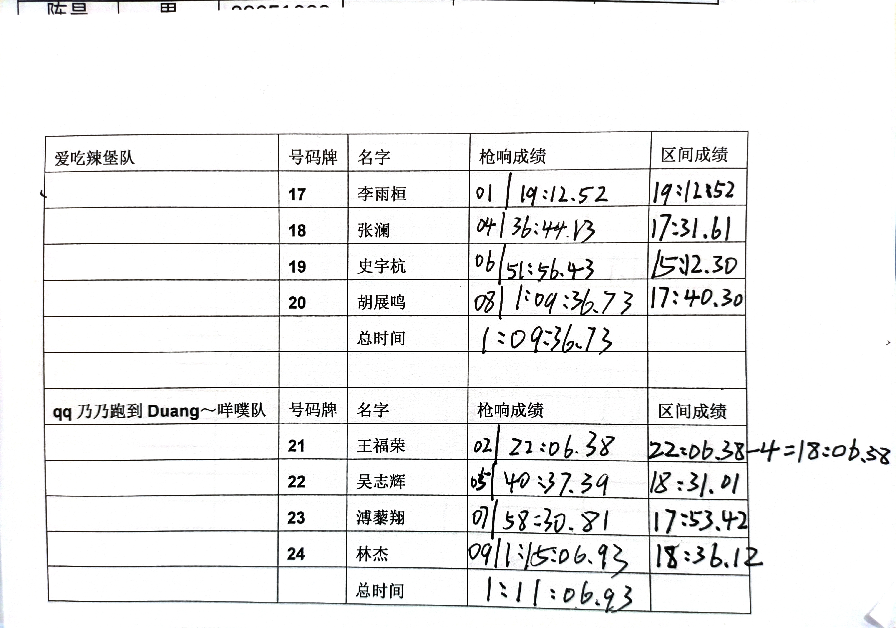
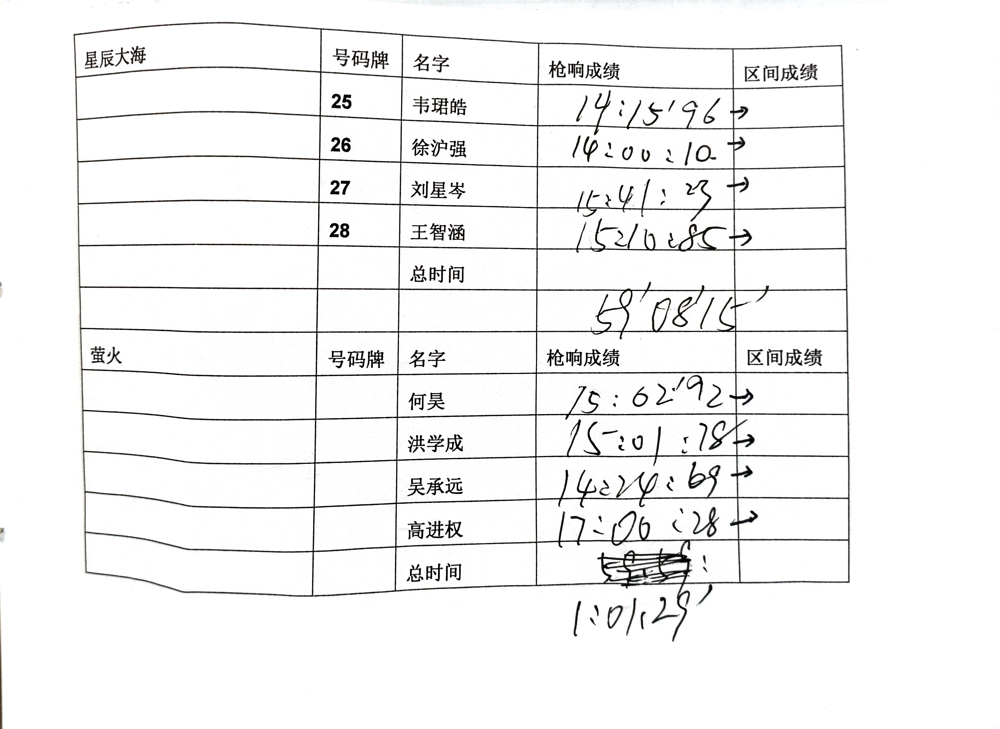
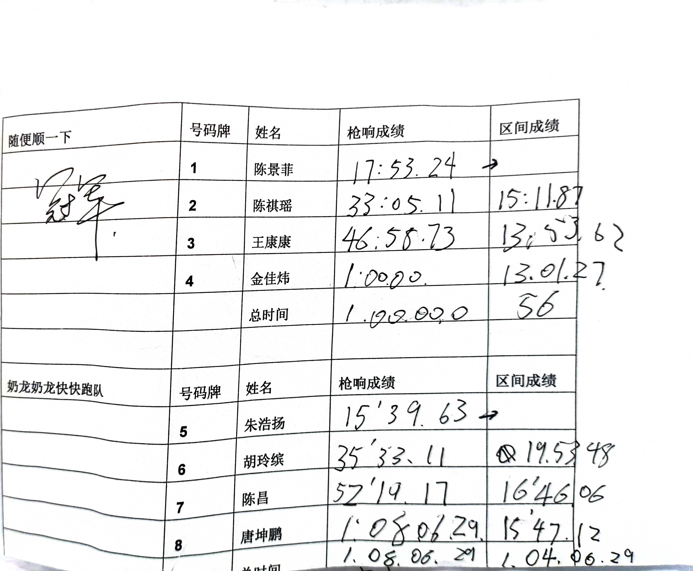
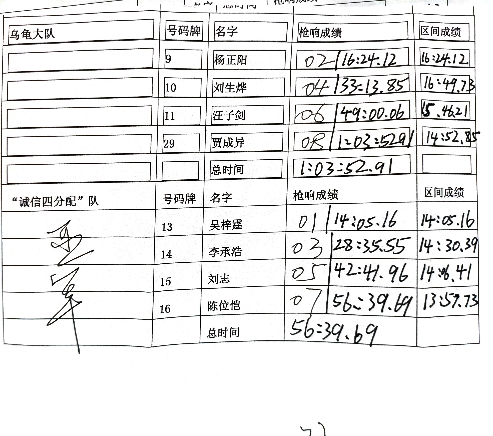

# 第一届下沙高校十英里比赛
于2024-11-20日下午4：45在浙江理工大学北田径场举行。活动顺利结束，本次活动共有8支队伍参加了比赛，最终评出了两支得奖队伍，一名区间最速奖。

## 比赛文件
.pdf)
.docx)
## 最终成绩公示

### 冠军队伍
#### 队名：随便顺一下队
#### 队员：
##### 陈景菲（女）
陈景菲，浙江理工大学23级本科生。
- 17:53.24
##### 陈祺瑶
陈祺瑶，浙江理工大学23级本科生。
- 15:11.3
##### 王康康
王康康，浙江理工大学22级本科生。
- 13:53.63
##### 金佳炜
金佳炜，浙江理工大学22级研究生。
- 13:01.27
#### 总成绩（结算后）：56:00

### 亚军队伍
#### 队名：“诚信四分配”队
#### 队员：
##### 吴梓霆
吴梓霆，杭州电子科技大学24级圣光机学院本科生。
- 14:05.16
###### 李承浩
李承浩，杭州电子科技大学23级自动化学院本科生。
- 14:30.39
##### 刘志
刘志，杭州电子科技大学24级理学院本科生。
- 14:06.41
##### 陈位恺
陈位恺，杭州电子科技大学24级自动化学院本科生。
- 13:57.73
#### 总成绩（结算后）：56:39

### 区间最速

#### 金佳炜
#### 最终成绩：13:01.27

