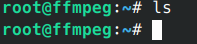
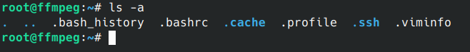
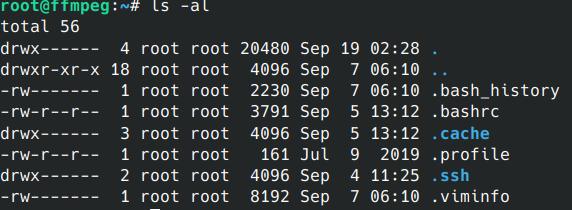

这里总结我自己使用Linux的过程中一些基础的指令以及`gcc`、`python`、`cmake`等开发工具的使用。适合未接触过Linux操作系统，想从`macOS`或者`Windows`操作系统转移到`Linux`操作系统的人入门阅读。
在使用Linux操作系统的过程中，你大多数时间会面对一个黑色的框框，它由指令和`Log`共同存在的模式，使得使用者可以快速的检查每一条指令的运行结果。指令的准确性能帮助开发者快速而精准地实现自己的想法。
# 为什么不使用Windows
`Windows`的设计理念就是让用户更少地使用指令，转而使用UI界面，所谓`UI`就是`User Interface`，但是到今天，这个UI的好用程度依旧不如指令。虽然UI大大降低了用户的学习成本，转而得到的是极低的使用效率。使用`SHELL`与机器快速的沟通是非常有必要的。
## windows也有SHELL
`Windows`的环境变量以及及其低效的注册表让我非常不喜欢它，对于环境变量的设置过于繁琐，注册表的可读性非常差。这些问题导致了`Windows`的`SHELL`难用而低效。~~沟槽的补全也是依托~~
## WSL好用吗？
`WSL`是`Windows`上的一个`Linux`子系统，实际上是通过虚拟机技术实现的，个人体验不错，不过苦于`Windows`的安装逻辑很难让人接受，安装`WSL`的难度不亚于学习如何安装`Ubuntu`——使用最多的`Linux`发行版。

接下来让我们开始`Linux`的学习吧！
# Linux部分
这里我几个部分来介绍`Linux`的基础知识，除了`Vim编辑器`不是必须的以外，其他的章节几乎都是使用`Linux`必备的知识，请配合机器使用。跟着教程敲一敲这些指令，感受一下指令的魅力。
以下所有命令我都在`Ubuntu22.04`中测试通过。
## 系统基础指令
### ls
#### 显示未隐藏文件
开始，让我们看看当前目录有什么东西。`ls`命令可以列出当前目录的文件。默认不加参数的`ls`运行效果大概为这样：
```bash
ls
```

#### 显示隐藏文件
你会发现没有任何东西（或者有一些文件存在），这是因为`ls`默认只显示未隐藏的文件，在`Linux`中，以`.`开始的文件都会被隐藏，你可以使用`ls -a`来列出所有的文件。
```bash
ls -a
```

#### 列出文件的信息
上面的命令虽然列出了所有文件的名字，但是我们不能得到文件除了名字以外的其他信息，我们可以使用`ls -al`来获取所有文件的信息：
```bash
ls -al
```

里面包括了很多信息，我们一一来讲：
- drwx------
- root 属于用户
- root 属于用户组
- 20480 大小
- Sep 修改月份
- 19 修改日期
- 02:28 修改时间
- . 文件（目录）名字

然后我再解释一下第一行的意义`drwx------`
我们需要把它拆开来看，分成`1 3 3 3`来解析这一行，首先这一行是`Linux`中的权限标识，拆开之后分别是：
- d 是否为目录
- rwx 当前用户的权限
- `---` 当前用户组的权限
- `---` 其他用户的权限

`-` 表示无权限，`r`表示`read`可读，`w`表示`write`可写，`x`表示可执行。
#### 列出文件的可读大小
前面的信息中，文件大小使用的单位是`Byte`这个单位不方便人类阅读，我们可以使用 `-h`参数来让这个大小转换为`KB`、`MB`、`GB`（根据文件大小自动转换）。
```bash
ls -alh
```

这条命令是我们最常用的，你可以一直使用这个。
### cd
`cd`命令相信你不陌生，在`Windows`中的`SHELL`里也存在这个命令，它的全称可能是`Change dir`或者`Change disk`，这些可以帮助你记住它，具体的使用方法是：
```bash
# cd <dir>
cd ~ # 去到用户目录
cd .. #  去到上一层目录
cd /root # 去到指定目录
```
这条命令并不难理解，但是这里我需要给你讲解`Linux`中的路由机制。
### 文件路径
`Linux`中存在两种路径格式
- 相对路径
- 绝对路径

绝对路径以`/`开头，表示从系统的根目录开始索引，而相对路径不以`/`开头，表示从当前目录开始索引。
比如我们现在有这样的文件结构：
- /
	- root/
		- .ssh/
	- home/
		- zhywyt/

首先我们去到`/home/zhywyt`可以使用（注意，这条命令你可能无法运行，因为你没有这个目录，可以把`zhywyt`替换为你的用户名）。
```bash
cd /home/zhywyt
```
这里我们用的是绝对路径，然后我们想再去`/root/.ssh/`目录，上面的命令已经让我们到了`/home/zhywyt/`了，我们可以使用相对路径来路由到新的目录：
```bash
cd ../../root/.ssh
```
特殊的，`Linux`中还存在一个用户目录的概念，你可以使用
```bash
cd ~
```
去到你当前用户的用户目录，除了`root`用户在`/root/`以外，其他用户都在`/home/<用户名>`下。

## 关于apt包管理器
接下来我讲解一下`Ubuntu`（Linux 发行版）中的包管理器`apt`的基础使用。
### 索引概念
首先我为你介绍一下`apt`的索引概念，`apt`包管理器使用软件源索引的方式来查找你需要的软件包，关于索引是什么，你可以访问这个链接来感受一下[USTC镜像源](https://mirrors.ustc.edu.cn/ubuntu/)，它其实就是`apt`帮你存储的软件对应下载地址的一个字典，你可以简单的通过软件名字来索引这些地址。理解了索引之后，再次面对`apt 换源`、`apt update`之类的问题你就会很清晰了。
我们的`apt`会先从你的软件源中获取索引，并保存在本地，下次需要的时候直接访问。但是由于软件源中的索引是动态更新的，所以我们需要定期运行更新索引的命令`apt update`，注意你要区分它和`apt upgrade`的区别。后者是用于更新软件包而非索引的。<font color='red'>该命令非常危险。</font>

请运行一下命令后继续后面的实验：
```bash
apt update
```
如果这个命令运行得非常缓慢的话，可能是因为你的源地址为国外，而你又没有开启代理。你可以选在开启代理或者[UTSC apt 镜像源配置](https://mirrors.ustc.edu.cn/help/ubuntu.html#:~:text=Learn%20how)
或者简单的使用这一句命令更换镜像源：
```bash
sudo sed -i 's@//.*archive.ubuntu.com@//mirrors.ustc.edu.cn@g' /etc/apt/sources.list
apt update
```
### 搜索
`apt`提供从索引中检索软件包的功能，比如我需要查找`gcc`软件包，我们可以运行此命令来查找：
```bash
apt search gcc
```
你会发现有非常多的输出，但是就是没找到你想要的gcc，你可以使用以下命令筛选结果中带`gcc`的索引：
```bash
apt search gcc | grep gcc
```
这条命令在后续的`其他指令`中详细介绍。
### 下载

上面的命令执行之后还是有很多结果，但是我能找到自己想要的软件包，找到它的正确名字后你可以使用该命令安装它：
```bash
sudo apt install gcc
```
这里的`sudo`是因为我们的`apt`部分操作是需要管理员权限的，使用`sudo`可以借用管理员权限安装该软件包。
安装好之后，大部分软件包会为你配置环境变量，你可以直接使用`gcc`来访问该软件。更多的软件需要你自己探索。

### 从本地deb安装
如果你在网上下载了一个`deb`，也可以使用`apt`来进行安装。比如我们去网上下载一个`linuxqq`，[QQ](https://im.qq.com/linuxqq/index.shtml#:~:text=QQ%20Linux%E7%89%88)，选择`x86`下的`deb`下载。得到一个安装包，然后在下载目录打开终端
```bash
# 注意这里输入你自己安装包的名字，并在前面加`./`
sudo apt install ./QQ_3.2.12_240902_amd64_01.deb
```
### 更新
<font color='red'>下面的命令请勿运行</font>
```bash
sudo apt upgrade
```

### 检查
我们可以通过下面的命令检查我们已安装的软件包：
```bash
apt list --installed 
apt list --installed | grep gcc
```
### 卸载
<font color='red'>请勿卸载</font>
我们可以简单的使用
```bash
sudo apt remove gcc
```
来卸载gcc，但是这样的卸载方式不会清理该软件的配置文件、缓存。你可以添加`--purge`参数来清理他们：
```bash
sudo apt remove --purge gcc
```
由于软件包之间存在联系，在我们卸载了一些软件之后，会存在某些软件不再有意义的情况，但是`apt`不会帮我们清理他们，你可以运行
```
sudo apt autoremove
```
来清理这部分软件。这个命令是安全的，他不会删除你任何有用的软件包。

# 开发工具部分
## C/C++
C/C++的开发工具我只介绍基础的编译器，关于调试器你可以自行STFW(Search The Fucking Web)。
### gcc & g++
Ubuntu默认安装gcc，但是你可以使用以下命令更新他们：
```bash
sudo apt install gcc g++
```
然后在当前目录创建一个`.c`文件：
```bash
touch first.c
echo '#include<stdio.h>'>first.c&&echo 'int main(){printf("Hello World\n");return 0;}' >> first.c
gcc first.c -o first
./first
```
看不懂没关系，我只需要你能运行这些命令就行了，我来给你讲解重要部分：
```bash
gcc first.c -o first
```
这里输入了一个`.c`文件，并输出一个可执行文件`first`。（Linux操作系统中的可执行文件可以不需要后缀名）。
```bash
./first
```
使用`./`来指定可执行文件并运行，如果你顺利的执行这些命令的话，你应该得到这样的输出：
```bash
root@ffmpeg:~# ./first    
Hello World
```
`g++`的使用和`gcc`的用法没有太大区别，但是`g++`还可以编译`C++`的代码，他们以`.cpp`结尾。

## python
python可以讲的东西很多，这里我主要讲一下它的两个包管理器，一个是pip，一个是conda。其中pip只用于管理单环境的python包，而conda可以创建虚拟环境，分割不同的python环境。
<font color='red'>建议所有的环境都使用codna配合pip使用</font>
### conda
首先我们需要安装conda：
```bash
wget https://repo.anaconda.com/archive/Anaconda3-2024.06-1-Linux-x86_64.sh
chmod +x Anaconda3-2024.06-1-Linux-x86_64.sh
./Anaconda3-2024.06-1-Linux-x86_64.sh
# 激活conda
eval "$($(pwd)/anaconda3/bin/conda shell.bash hook)"
# 可选
sudo ln -s $(pwd)/anaconda3/bin/conda /bin/conda
```
#### 创建虚拟环境
下面的`<envname>`指的是一个占位符，你可以替换为你需要的环境名字，后面的python版本也可以换。需要注意的是，conda指定包的版本使用`=version`，而pip使用`==versino`这是一个小区别，需要注意。
```bash
conda create -n <envname> python=3.10
```
#### 检查所有环境
```bash
conda env list
```
#### 激活虚拟环境
```bash
conda activate <envname>
```
#### 安装python包
下面实例展示了安装`numpy`的方法。
```bash
# conda install <pakName>
conda install numpy
```
#### 查看python包
```bash
conda list
```
#### 卸载python包
```bash
conda remove numpy
```
### pip
`pip`是一个python包管理系统，一般会跟随python安装，pip的操作非常简单，速度非常快速。并且有大量的镜像源。
#### pip 安装
```bash
pip install numpy
```
#### pip 查看
```
pip list
```
#### pip 卸载
```bash
pip uninstall numpy
```
### pip & conda
我们一般使用conda创建虚拟环境，并使用pip安装我们需要的包，这样可以达到干净+迅速的包安装体验。
## vim编辑器
 关于`Vim`编辑器，它是一个非常好用的文本编辑器，事实上这篇文章就是`zhywyt`使用该编辑器完成的，这可以让我在不使用鼠标和触摸板的情况下快速的定位我需要的位置。`Vim`的教程我暂时不写，这里给出我学习他的地址[Just-Vim-It](https://github.com/Nauxscript/Just-Vim-It.git)
## git
这部分推荐廖雪峰的网站[git教程](https://liaoxuefeng.com/books/git/introduction/index.html#:~:text=%E5%BB%96%E9%9B%AA%E5%B3%B0%E6%98%AF%E4%B8%80%E4%BD%8D%E8%B5%84%E6%B7%B1%E8%BD%AF%E4%BB%B6)

## 其他常用指令
**这部分以后再补细节。**
### grep （抓取）
grep使用字符串匹配，将输入中与`pattern`完全匹配的部分行筛选出来，你可以在测试这样一个命令：
```bash
du | grep ssh
```
这条命令会找到你的文件系统中你有权访问的所有路径中带`ssh`的文件。但是有时候我们想要获取`pattern`附近的信息，你可以使用`-A`(after)参数指定行后多少行的信息，类似的`-B`(before) 参数可以指定行前多少行的信息。
```bash
du | grep -A 3 ssh
```

### touch （创建文件）
尝试使用以下命令创建一个文件：
```bash
touch file
```
尝试使用以下命令创建一百各文件：
```bash
touch file{1..100}
```
### echo （打印字符串）
尝试运行这些命令，思考运行结果：
其中`SHELL`是一个环境变量，应该是这样的记录`SHELL=/bin/bash`
```bash
echo $SHELL  $SHELL
echo "$SHELL  $SHELL"
echo '$SHELL  $SHELL'
```
它的输出结果应该像这样：
```bash
/bin/bash /bin/bash  
/bin/bash  /bin/bash  
$SHELL  $SHELL
```
希望你发现了这些细微的区别。第一条命令，`echo $SHELL  $SHELL`相当于`echo`接受了两个参数，所以他会让他们空一格并打印，而第二条命令`echo "$SHELL  $SHELL"`只接受了一个参数，`"$SHELL $SHELL"`但是`""`会让包括的字符进行转义，比如`"$SHELL"`就应该转义为`/bin/bash`，而最后一条指令的`''`，会保持用户的所有输入，而不进行转义。
现在我们向一个文件中写入一些东西，之后会用到它。
```bash
echo "info" > file1
```
### cat （打印文件内容）
`cat`命令可以读出文件中的所有东西，并打印自爱控制台上，文件可以是文本文件，也可以是二进制文件，只是会乱码，你只需要掌握它的输出就可以了。一般配合管道命令一起使用。
```bash
cat file1
```
### mkdir （创建文件夹）
尝试使用以下指令创建一个文件夹
```bash
mkdir testdir
```
### rmdir （删除空文件夹）
尝试使用以下指令删除刚刚创建的空文件夹
```bash
rmdir testdir
```
尝试创建一个非空的文件夹，并删除他们：
```
mkdir testdir
touch testdir/file{1..100}
rmdir testdir
```
不出以意外的话它会提醒你这个文件夹是非空的。非空文件夹我们使用`rm -r`命令删除他们。
### rm （删除）
尝试使用以下命令删除前面使用touch创建的文件：
```bash
rm file*
```
尝试使用以下命令删除前面的非空文件夹：
```bash
rm -r testdir
```
`-r`的意思就是递归的删除，<font color='red'>注意：该参数肥差能够危险，谨慎使用。</font>
### ln （链接）
`ln`连接分成两种，一种是软连接，一种是硬连接。
#### 软连接
```bash
ln -s /path/to/source /path/to/destination
```
软连接得到的结果是`<destionation>`是`<source>`的一个跳转，相当于不保存任何文件数据，只是保存了一条连接。
#### 硬连接
硬连接只能针对于文件，而软连接可以用于文件夹。
```bash
ln /path/to/source /path/to/destionation
```
需要注意的是硬连接得到的结果是同一个文件拥有两个不同的文件名（也可以相同，这里只绝对路径不同），对于操作系统来说这两个文件是平权的没有任何区别。
#### 连接需要使用绝对路径
<font color='red'>所有的连接操作中的路径都需要使用绝对路径！</font>
### ps （任务）
```bash
ps -axu
```
自行查看输出，并尝试配合grep命令获取你想要的进程信息。
### pgrep （抓取pid）
`pgrep`可以获取指定行的pid，pid是一个任务的唯一标识，用于查询进程的状态或者杀死它。~~我只用来杀死他们~~
```bash
ps | pgrep ssh
```
### xargs （输入转参数）
`xargs`可以将输入的数据分割、转化为后面指令的参数，你可以尝试配合pgrep使用批量杀死一些进程：
<font color='red'>此命令会杀死ssh进程，请勿执行</font>
```bash
ps | pgrep ssh | xargs kill -9 
```
### > 和 >>（重定向命令）
重定向命令有两个，一个是`>`会先格式化目标再输入，另一个是`>>`，不会格式化目标，而是在后面添加。
```bash
echo "zhywyt1" > test.txt 
echo "zhywyt2" >> test.txt
```
值得一提的是，当文件不存在时，他会创建该文件，并写入。
### | （管道命令）
管道命令是`|`，上面已经用的很多了，它可以把前一个命令的输出作为后一个命令的输入。
```bash
cat test.txt
cat test.txt | grep 1
```
尝试这些命令，并感受他们的作用。
### 2>&1 （错误日志捕获）
普通的重定向只会把标准输出重定向到新文件，但是错误日志还是会输出到控制台，如果你想要所有的输出和日志全部重定向到文件你可以尝试这样的命令：
```bash
cat file1 2>&1 > log.txt
```
非常抱歉，我一下子无法找到很好的、简单的、带错误输出的例子，所以你可以在以后遇到此类问题的时候再尝试该操作。
## 网络部分
### ping （检查联通性）
`ping`命令非常简单，无需掌握太多参数，感兴趣可以自己查阅。`ping`命令可以接受`ip`或者`域名`。你可以尝试`ping`必应：
```bash
ping cn.bing.com
```
 为什么不ping百度？
 ~~百度太垃圾了~~
### traceroute （检查路由路径）
`traceroute`命令和`ping`命令几乎没有使用区别。但是输出更加的精细，它会显示每一跳（一跳之经过一个路由器转发一次）的路径与时延。
```
traceroute cn.bing.com
```
看不懂没关系，学习了一些网络知识就能看懂了。
### ip addr （检查网络适配器）
```bash
ip addr
```
全程其实不是`ip addr`而是`ip address`你甚至可以使用`ip ad`来调用它。输出请自行理解，需要一定的网络知识。
### ip route （检查路由表）
```bash
ip route
```
可以输出当前机器的所有路由表。
### netstat （检查网络连接tcp udp socket）
```bash
netstat
```
该命令可以直接运行，你可以看到所有的`TCP`、`UDP`、`socket`通信的信息。
```bash
netstat -p 
```
该命令可以查询当前的正在使用Socket的程序识别码和程序名称。~~配合pgre获取pid并杀死他们！~~