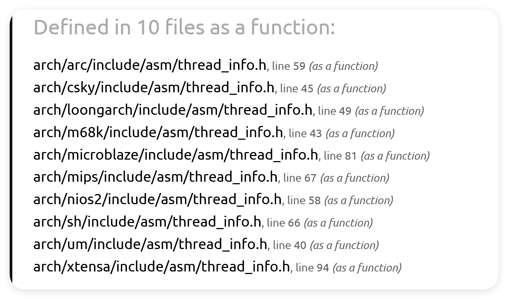

# fork
[sys.h - tools/include/nolibc/sys.h - Linux source code v6.8 - Bootlin Elixir Cross Referencer](https://elixir.bootlin.com/linux/v6.8/source/tools/include/nolibc/sys.h#L332)
```c
// tools/include/nolibc/sys.h
pid_t fork(void){
	return __sysret(sys_fork());
}
```

## __sysret
该函数复制了arg，并判断arg的值，如果arg小于零，则尝试设置EROORNO为-arg，并返回-1，否则直接返回arg。
[sys.h - tools/include/nolibc/sys.h - Linux source code v6.8 - Bootlin Elixir Cross Referencer](https://elixir.bootlin.com/linux/v6.8/source/tools/include/nolibc/sys.h#L39)
```bash
#define __sysret(arg)							\
({									\
	__typeof__(arg) __sysret_arg = (arg);				\
	(__sysret_arg < 0)                              /* error ? */	\
		? (({ SET_ERRNO(-__sysret_arg); }), -1) /* ret -1 with errno = -arg */ \
		: __sysret_arg;                         /* return original value */ \
})
```

### SET_ERRORNO
[errno.h - tools/include/nolibc/errno.h - Linux source code v6.8 - Bootlin Elixir Cross Referencer](https://elixir.bootlin.com/linux/v6.8/source/tools/include/nolibc/errno.h#L13)
```bash
#ifndef NOLIBC_IGNORE_ERRNO
#define SET_ERRNO(v) do { errno = (v); } while (0)
int errno __attribute__((weak));
#else
#define SET_ERRNO(v) do { } while (0)
#endif

```
关于ERROR_NO[Linux errno详解 - Jimmy\_Nie - 博客园](https://www.cnblogs.com/Jimmy1988/p/7485133.html)

## sys_fork
[fork.c - kernel/fork.c - Linux source code v6.8 - Bootlin Elixir Cross Referencer](https://elixir.bootlin.com/linux/v6.8/source/kernel/fork.c#L2984)
```c
SYSCALL_DEFINE0(fork)
{
#ifdef CONFIG_MMU
	struct kernel_clone_args args = {
		.exit_signal = SIGCHLD,
	};

	return kernel_clone(&args);
#else
	/* can not support in nommu mode */
	return -EINVAL;
#endif
}
```
### struct kernel_clone_args
[task.h - include/linux/sched/task.h - Linux source code v6.8 - Bootlin Elixir Cross Referencer](https://elixir.bootlin.com/linux/v6.8/source/include/linux/sched/task.h#L23)
```c
struct kernel_clone_args {
	u64 flags;
	int __user *pidfd;
	int __user *child_tid;
	int __user *parent_tid;
	const char *name;
	int exit_signal;
	u32 kthread:1;
	u32 io_thread:1;
	u32 user_worker:1;
	u32 no_files:1;
	unsigned long stack;
	unsigned long stack_size;
	unsigned long tls;
	pid_t *set_tid;
	/* Number of elements in *set_tid */
	size_t set_tid_size;
	int cgroup;
	int idle;
	int (*fn)(void *);
	void *fn_arg;
	struct cgroup *cgrp;
	struct css_set *cset;
};

```
### kernel_clone
[fork.c - kernel/fork.c - Linux source code v6.8 - Bootlin Elixir Cross Referencer](https://elixir.bootlin.com/linux/v6.8/source/kernel/fork.c#L2861)
```c
/*
 *  Ok, this is the main fork-routine.
 *
 * It copies the process, and if successful kick-starts
 * it and waits for it to finish using the VM if required.
 *
 * args->exit_signal is expected to be checked for sanity by the caller.
 */
pid_t kernel_clone(struct kernel_clone_args *args)
{
	u64 clone_flags = args->flags;
	struct completion vfork;
	struct pid *pid;
	struct task_struct *p;
	int trace = 0;
	pid_t nr;

	/*
	 * For legacy clone() calls, CLONE_PIDFD uses the parent_tid argument
	 * to return the pidfd. Hence, CLONE_PIDFD and CLONE_PARENT_SETTID are
	 * mutually exclusive. With clone3() CLONE_PIDFD has grown a separate
	 * field in struct clone_args and it still doesn't make sense to have
	 * them both point at the same memory location. Performing this check
	 * here has the advantage that we don't need to have a separate helper
	 * to check for legacy clone().
	 */
	if ((args->flags & CLONE_PIDFD) &&
	    (args->flags & CLONE_PARENT_SETTID) &&
	    (args->pidfd == args->parent_tid))
		return -EINVAL;

	/*
	 * Determine whether and which event to report to ptracer.  When
	 * called from kernel_thread or CLONE_UNTRACED is explicitly
	 * requested, no event is reported; otherwise, report if the event
	 * for the type of forking is enabled.
	 */
	if (!(clone_flags & CLONE_UNTRACED)) {
		if (clone_flags & CLONE_VFORK)
			trace = PTRACE_EVENT_VFORK;
		else if (args->exit_signal != SIGCHLD)
			trace = PTRACE_EVENT_CLONE;
		else
			trace = PTRACE_EVENT_FORK;

		if (likely(!ptrace_event_enabled(current, trace)))
			trace = 0;
	}

	p = copy_process(NULL, trace, NUMA_NO_NODE, args);
	add_latent_entropy();

	if (IS_ERR(p))
		return PTR_ERR(p);

	/*
	 * Do this prior waking up the new thread - the thread pointer
	 * might get invalid after that point, if the thread exits quickly.
	 */
	trace_sched_process_fork(current, p);

	pid = get_task_pid(p, PIDTYPE_PID);
	nr = pid_vnr(pid);

	if (clone_flags & CLONE_PARENT_SETTID)
		put_user(nr, args->parent_tid);

	if (clone_flags & CLONE_VFORK) {
		p->vfork_done = &vfork;
		init_completion(&vfork);
		get_task_struct(p);
	}

	if (IS_ENABLED(CONFIG_LRU_GEN_WALKS_MMU) && !(clone_flags & CLONE_VM)) {
		/* lock the task to synchronize with memcg migration */
		task_lock(p);
		lru_gen_add_mm(p->mm);
		task_unlock(p);
	}

	wake_up_new_task(p);

	/* forking complete and child started to run, tell ptracer */
	if (unlikely(trace))
		ptrace_event_pid(trace, pid);

	if (clone_flags & CLONE_VFORK) {
		if (!wait_for_vfork_done(p, &vfork))
			ptrace_event_pid(PTRACE_EVENT_VFORK_DONE, pid);
	}

	put_pid(pid);
	return nr;
}
```

### copy_process
[fork.c - kernel/fork.c - Linux source code v6.8 - Bootlin Elixir Cross Referencer](https://elixir.bootlin.com/linux/v6.8/source/kernel/fork.c#L2240)
```c
__latent_entropy struct task_struct *copy_process(
					struct pid *pid,
					int trace,
					int node,
					struct kernel_clone_args *args)
{
```
这个函数非常长，自己去浏览器看。主要的函数是
```c
p = dup_task_struct(current, node);
```
current :
[current.h - include/asm-generic/current.h - Linux source code v6.8 - Bootlin Elixir Cross Referencer](https://elixir.bootlin.com/linux/v6.8/source/include/asm-generic/current.h#L8)
```c
#define get_current() (current_thread_info()->task)
#define current get_current()
```
再往下就没办法深纠了：

只能知道它返回了thread_info指针：
```c
static inline __attribute_const__ struct thread_info *current_thread_info(void)
{
	register unsigned long sp asm("sp");
	return (struct thread_info *)(sp & ~(THREAD_SIZE - 1));
}
```
[thread\_info.h - arch/arc/include/asm/thread\_info.h - Linux source code v6.8 - Bootlin Elixir Cross Referencer](https://elixir.bootlin.com/linux/v6.8/source/arch/arc/include/asm/thread_info.h#L59)
### dup_task_struct
[fork.c - kernel/fork.c - Linux source code v6.8 - Bootlin Elixir Cross Referencer](https://elixir.bootlin.com/linux/v6.8/source/kernel/fork.c#L1097)
该函数完成了复制进程的操作，
```c
static struct task_struct *dup_task_struct(struct task_struct *orig, int node){
	...
	tsk = alloc_task_struct_node(node);
	...
	account_kernel_stack(tsk, 1);
	...
	setup_thread_stack(tsk, orig);
	clear_user_return_notifier(tsk);
	clear_tsk_need_resched(tsk);
	set_task_stack_end_magic(tsk);
	clear_syscall_work_syscall_user_dispatch(tsk);
	#ifdef CONFIG_STACKPROTECTOR
	tsk->stack_canary = get_random_canary();
#endif
	if (orig->cpus_ptr == &orig->cpus_mask)
		tsk->cpus_ptr = &tsk->cpus_mask;
	dup_user_cpus_ptr(tsk, orig, node);

	/*
	 * One for the user space visible state that goes away when reaped.
	 * One for the scheduler.
	 */
	refcount_set(&tsk->rcu_users, 2);
	/* One for the rcu users */
	refcount_set(&tsk->usage, 1);
#ifdef CONFIG_BLK_DEV_IO_TRACE
	tsk->btrace_seq = 0;
#endif
	tsk->splice_pipe = NULL;
	tsk->task_frag.page = NULL;
	tsk->wake_q.next = NULL;
	tsk->worker_private = NULL;

	kcov_task_init(tsk);
	kmsan_task_create(tsk);
	kmap_local_fork(tsk);

#ifdef CONFIG_FAULT_INJECTION
	tsk->fail_nth = 0;
#endif

#ifdef CONFIG_BLK_CGROUP
	tsk->throttle_disk = NULL;
	tsk->use_memdelay = 0;
#endif

#ifdef CONFIG_ARCH_HAS_CPU_PASID
	tsk->pasid_activated = 0;
#endif

#ifdef CONFIG_MEMCG
	tsk->active_memcg = NULL;
#endif

#ifdef CONFIG_CPU_SUP_INTEL
	tsk->reported_split_lock = 0;
#endif

#ifdef CONFIG_SCHED_MM_CID
	tsk->mm_cid = -1;
	tsk->last_mm_cid = -1;
	tsk->mm_cid_active = 0;
	tsk->migrate_from_cpu = -1;
#endif
	return tsk;

free_stack:
	exit_task_stack_account(tsk);
	free_thread_stack(tsk);
free_tsk:
	free_task_struct(tsk);
	return NULL;
}
```

当然里面还是嵌套了很多层：
#### account_kernel_stack
将该进程加入
### __latent_entropy
[Fetching Title#73pr](https://blog.csdn.net/qq_58538265/article/details/133914860)
​ latent_entropy是gcc编译器支持的一个编译特性，它只能作用于函数和变量。如果它是在一个函数上，那么plugin将对其进行检测;如果属性在一个变量上，那么plugin将用一个随机值初始化它。变量必须是整型、整型数组类型或具有整型字段的结构。
### SYSCALL_DEFINED0
[syscalls.h - include/linux/syscalls.h - Linux source code v6.8 - Bootlin Elixir Cross Referencer](https://elixir.bootlin.com/linux/v6.8/source/include/linux/syscalls.h#L216)
```c
#define SYSCALL_DEFINE0(sname)					\
	SYSCALL_METADATA(_##sname, 0);				\
	asmlinkage long sys_##sname(void);			\
	ALLOW_ERROR_INJECTION(sys_##sname, ERRNO);		\
	asmlinkage long sys_##sname(void)
```