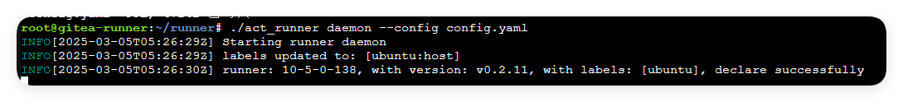
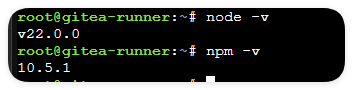
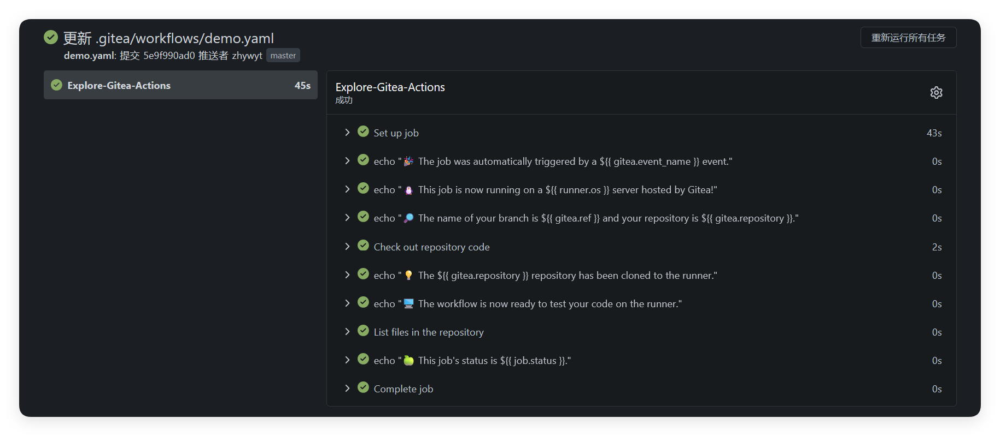

# 前言
最近在为我的gitea服务添加Actions模块，但是发现官网的方式有一个严重的问题：docker内无法正常访问外网，于是我就想使用自建容器来实现在本地运行的runner。下面是官网教程：
[Overview \| Gitea Documentation](https://docs.gitea.com/zh-cn/usage/actions/overview)
趁着容器复制的时间来写了这篇记录文档。
## 安装act_runner
目标机器需要安装[gitea/act\_runner: A runner for Gitea based on act. - act\_runner - Gitea: Git with a cup of tea](https://gitea.com/gitea/act_runner)，用于向自己的服务注册一个runner。下载自己对应的版本就可以了。然后需要创建一个配置文件，其中你的token可以在你自己的gitea管理界面下的action找到。如果找不到请查阅官方文档。
```bash
# 交互形式
wget https://gitea.com/gitea/act_runner/releases/download/v0.2.11/act_runner-0.2.11-linux-amd64
mv act_runner-0.2.11-linux-amd64 act_runner
mkdir runner && mv act_runner runner && cd runner
chmod +x act_runner
./act_runner register
./act_runner generate-config > config.yaml
vim config.yaml
```
要将它默认的几个容器配置删除，找到labels下的，修改为以下结构，其实就是去除了容器的形式，只允许使用host运行。
```bash
*** config.yaml 2025-03-05 05:13:35.480359027 +0000
--- config.yaml.bk      2025-03-05 05:10:54.361732625 +0000
***************
*** 40,43 ****
    labels:
!     - "ubuntu:host"
!

--- 40,44 ----
    labels:
!     - "ubuntu-latest:docker://gitea/runner-images:ubuntu-latest"
!     - "ubuntu-22.04:docker://gitea/runner-images:ubuntu-22.04"
!     - "ubuntu-20.04:docker://gitea/runner-images:ubuntu-20.04"

```
然后运行测试一下是否能正常启动：
```bash
./act_runner daemon --config config.yaml
```
成功的输出大概是这样：

然后`Ctrl+C`终止它，回到工作目录，准备安装node。
## 安装node
来到官网，选择最新版，Linux和你最喜欢的下载器，这里我使用`NVM`测试。
[Node.js — Download Node.js®](https://nodejs.org/zh-cn/download)
提前安装必须工具：
```bash
sudo apt install curl
```
下面的指令或许需要科学上网，请自行准备本机科学上网方式。
安装`nvm`
```basoad and install nvm:
curl -okh
# Download and install nvm:
curl -o- https://raw.githubusercontent.com/nvm-sh/nvm/v0.40.1/install.sh | bash

# in lieu of restarting the shell
\. "$HOME/.nvm/nvm.sh"

```
这里提供一个nvm换源的方法：[nvm 切换国内镜像 \| NVM](https://nvm.p6p.net/use/mirror.html)
安装`node`
```bash
# 换源前
nvm install 22
# 换源后
nvm install 22.0.0
```
国内源很快，安装完后检查版本：


## 构建一个简单的测试

首先启动你的runner
```bash
./act_runner daemon --config config.yaml
```
然后在你的任意仓库建立一个文件：`.gitea/workflows/demo.yaml'写入以下内容：
```yaml
name: Gitea Actions Demo
run-name: ${{ gitea.actor }} is testing out Gitea Actions 🚀
on: [push]

jobs:
  Explore-Gitea-Actions:
    runs-on: ubuntu
    steps:
      - run: echo "🎉 The job was automatically triggered by a ${{ gitea.event_name }} event."
      - run: echo "🐧 This job is now running on a ${{ runner.os }} server hosted by Gitea!"
      - run: echo "🔎 The name of your branch is ${{ gitea.ref }} and your repository is ${{ gitea.repository }}."
      - name: Check out repository code
        uses: actions/checkout@v4
      - run: echo "💡 The ${{ gitea.repository }} repository has been cloned to the runner."
      - run: echo "🖥️ The workflow is now ready to test your code on the runner."
      - name: List files in the repository
        run: |
          ls ${{ gitea.workspace }}
      - run: echo "🍏 This job's status is ${{ job.status }}."
```
这里最重要的是`runs-on`，需要配置为上面你在`config.yaml`文件里`labels`下定义的runner中选一个。Push后会自动开始构建，构建成功就像这样：

那么就大功告成了！然后就可以尝试其他的action了！


## 镜像actions/checkout仓库

在我的测试用，如果runner机器与github的联通不是很通畅的话，尝试从github拉取action的时候会出现错误，所以可以选择从自己的仓库中拉取，在上面的`demo.yaml`文件中，修改`uses:`字段为：
```bash
- uses: http://<您的gitea服务器地址>/actions/checkout@v4
```
即可访问，但是注意需要将镜像的仓库转让给actions组织，转让仓库可以在仓库设置的最下方找到：

## 给git加代理
不过我建议直接给runner加上git的代理，这样可以最方便地移植github上的action。
```bash
git config --global http.proxy <your proxy addr>
git config --global https.proxy <your proxy addr>
```

那这篇文章就到这里咯，谢谢您的阅读！