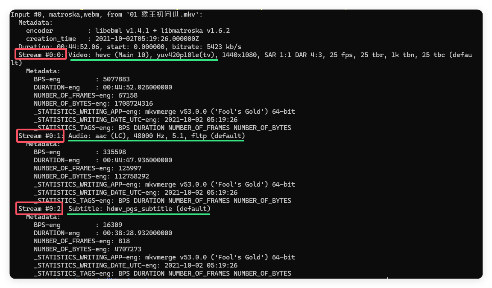
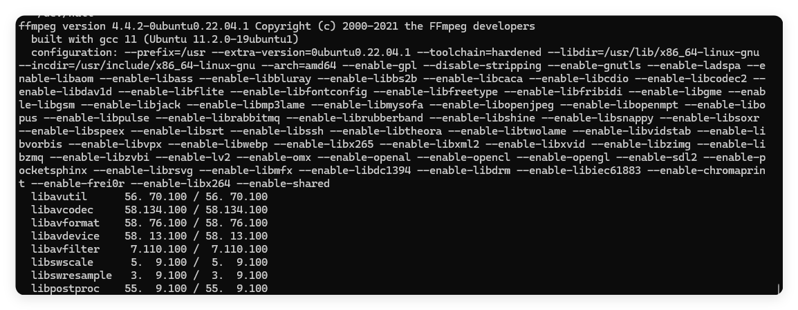
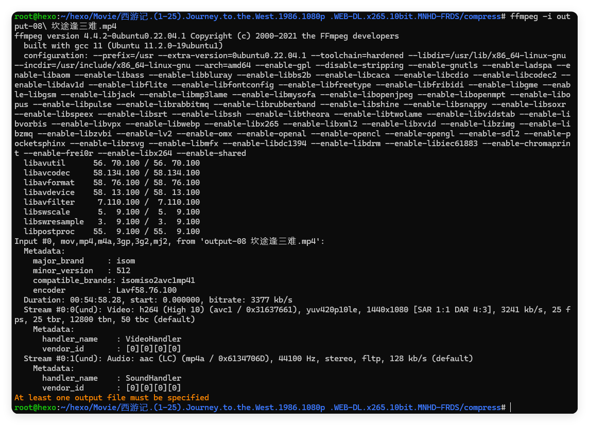
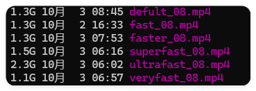

**无损**？这里指视觉无损，对于我们这些视力不太好的程序员来说视觉无损已经非常好了。我们需要使用到`ffmpeg`工具，这是一个十分强大的武器。但是刚接触到它的时候我会觉得它强大而无法掌握，直到现在我也不能说有多了解它，只能在文档的加持下才能完成自己需要的操作。今天我们需要无损压缩视频，首先我们要了解的是：**我们的视频能否还能被压缩？**

在压缩它之前，我们可以简单地检查一下我们的视频的编码方式，不管怎么样先安装`ffmpeg`再开始下面的操作吧。
```bash
sudo apt install ffmpeg
```

## 第一步：检查源文件

一个视频大多由三部分组成，画面（Video）、音频（Audio）、字幕（Subtitle）。~~我自己的翻译，英语不好还请自行理解~~我们可以简单地使用ffmpeg中附加的一个工具`ffprobe`来检查他们：

```bash
# ffprobe -i <checkfilename>
ffprobe -i 01\ 猴王初问世.mkv
```
你可以在结果中找到这三部分：


我们一般需要压缩视频的时候，大多从画面下手，也就是我们的Video，所以我们需要格外的关注我们的Video格式。（后面我都用`Video`代替`画面`）可以看到，这里我检查的是一个`.mkv`文件，它的Video编码格式是`hevc`也就是我们俗称的`H.265`，但是这个格式有一个很大的问题：<font color='red'>兼容性很差。</font>，需要注意的是`.mkv`是该视频的容器——而非编码方式，你需要使用`ffprobe`才能看到正确的编码格式。因为容器与编码方式是多对多的。

>HEVC（High Efficiency Video Coding），也称为H.265或H.265/MPEG-H Part 2，是一种视频压缩标准，它是继H.264（AVC）/MPEG-4 Part 10之后的新一代视频编码技术。HEVC旨在提供更高的数据传输效率，即在相同的数据率下实现更高质量的图像，或者在相同的图像质量下减少所需的数据量。

~~我非常讨厌H.265，主要还是因为它兼容性实在是太差了。因为我的视频都是存放在我的NAS中的，我需要经常使用web浏览、播放他们，而hevc(H.265)在大多情况下无法完成这个工作。~~

我们常见的格式有：
### 常见的Video编码格式

这里参考[wiki-视频压缩](https://zh.wikipedia.org/wiki/%E8%A6%96%E8%A8%8A%E5%A3%93%E7%B8%AE)

视频编码标准主要是由[ITU-T](https://zh.wikipedia.org/wiki/ITU-T "ITU-T")与[ISO](https://zh.wikipedia.org/wiki/ISO "ISO")／[IEC](https://zh.wikipedia.org/wiki/IEC "IEC")两大组织制定而成，其发展如下表所示。(<font color='red'>注：原文体验更佳</font>)

|   |   |   |   |   |
|---|---|---|---|---|
|年份|标准|制定组织|解除著作权保护  <br>（[DRM-free](https://zh.wikipedia.org/wiki/%E6%95%B0%E5%AD%97%E7%89%88%E6%9D%83%E7%AE%A1%E7%90%86#“DRM-Free” "数字版权管理")）|主要应用|
|**1984**|[H.120](https://zh.wikipedia.org/w/index.php?title=H.120&action=edit&redlink=1 "H.120（页面不存在）")|[ITU-T](https://zh.wikipedia.org/wiki/ITU-T "ITU-T")|是||
|**1990**|[H.261](https://zh.wikipedia.org/wiki/H.261 "H.261")|[ITU-T](https://zh.wikipedia.org/wiki/ITU-T "ITU-T")|是|[视频会议](https://zh.wikipedia.org/wiki/%E8%A6%96%E8%A8%8A%E6%9C%83%E8%AD%B0 "视频会议")、[视频通话](https://zh.wikipedia.org/wiki/%E8%A6%96%E8%A8%8A%E9%80%9A%E8%A9%B1 "视频通话")|
|**1993**|[MPEG-1第二部分](https://zh.wikipedia.org/wiki/MPEG-1 "MPEG-1")|[ISO](https://zh.wikipedia.org/wiki/ISO "ISO")／[IEC](https://zh.wikipedia.org/wiki/IEC "IEC")|是|影音光盘（[VCD](https://zh.wikipedia.org/wiki/VCD "VCD")）|
|**1995**|[H.262/MPEG-2第二部分](https://zh.wikipedia.org/wiki/MPEG-2 "MPEG-2")|[ISO](https://zh.wikipedia.org/wiki/ISO "ISO")／[IEC](https://zh.wikipedia.org/wiki/IEC "IEC")、[ITU-T](https://zh.wikipedia.org/wiki/ITU-T "ITU-T")|否|[DVD影碟](https://zh.wikipedia.org/w/index.php?title=DVD%E5%BD%B1%E7%A2%9F&action=edit&redlink=1 "DVD影碟（页面不存在）")（[DVD-Video](https://zh.wikipedia.org/wiki/DVD-Video "DVD-Video")）、[蓝光](https://zh.wikipedia.org/wiki/%E8%97%8D%E5%85%89 "蓝光")（[Blu-Ray](https://zh.wikipedia.org/wiki/%E8%97%8D%E5%85%89%E5%85%89%E7%A2%9F "蓝光光盘")）影碟、数字视频广播（[DVB](https://zh.wikipedia.org/wiki/DVB "DVB")）、[SVCD](https://zh.wikipedia.org/wiki/SVCD "SVCD")|
|**1996**|[H.263](https://zh.wikipedia.org/wiki/H.263 "H.263")|[ITU-T](https://zh.wikipedia.org/wiki/ITU-T "ITU-T")||[视频会议](https://zh.wikipedia.org/wiki/%E8%A6%96%E8%A8%8A%E6%9C%83%E8%AD%B0 "视频会议")、[视频通话](https://zh.wikipedia.org/wiki/%E8%A6%96%E8%A8%8A%E9%80%9A%E8%A9%B1 "视频通话")、[3G](https://zh.wikipedia.org/wiki/3G "3G")手机视频（[3GP](https://zh.wikipedia.org/wiki/3GP "3GP")）|
|**1999**|[MPEG-4第二部分](https://zh.wikipedia.org/wiki/MPEG-4 "MPEG-4")|[ISO](https://zh.wikipedia.org/wiki/ISO "ISO")／[IEC](https://zh.wikipedia.org/wiki/IEC "IEC")|否||
|**2003**|[H.264/MPEG-4 AVC](https://zh.wikipedia.org/wiki/H.264/MPEG-4_AVC "H.264/MPEG-4 AVC")|[ISO](https://zh.wikipedia.org/wiki/ISO "ISO")／[IEC](https://zh.wikipedia.org/wiki/IEC "IEC")、[ITU-T](https://zh.wikipedia.org/wiki/ITU-T "ITU-T")|否|[蓝光](https://zh.wikipedia.org/wiki/%E8%97%8D%E5%85%89 "蓝光")（[Blu-Ray](https://zh.wikipedia.org/wiki/%E8%97%8D%E5%85%89%E5%85%89%E7%A2%9F "蓝光光盘")）影碟、[高清DVD](https://zh.wikipedia.org/wiki/%E9%AB%98%E7%95%AB%E8%B3%AADVD "高清DVD")（[HD DVD](https://zh.wikipedia.org/wiki/HD_DVD "HD DVD")）、数字视频广播（[DVB](https://zh.wikipedia.org/wiki/DVB "DVB")）、[流媒体](https://zh.wikipedia.org/wiki/%E6%B5%81%E5%AA%92%E4%BD%93 "流媒体")、视频录制|
|**2013**|[高效率视频编码](https://zh.wikipedia.org/wiki/%E9%AB%98%E6%95%88%E7%8E%87%E8%A7%86%E9%A2%91%E7%BC%96%E7%A0%81 "高效率视频编码")（H.265/HEVC）|[ISO](https://zh.wikipedia.org/wiki/ISO "ISO")/[IEC](https://zh.wikipedia.org/wiki/IEC "IEC")、[ITU-T](https://zh.wikipedia.org/wiki/ITU-T "ITU-T")|否|[超高清蓝光光盘](https://zh.wikipedia.org/wiki/%E8%B6%85%E9%AB%98%E6%B8%85%E8%93%9D%E5%85%89%E5%85%89%E7%A2%9F "超高清蓝光光盘")（UHD Blu-Ray）、数字视频广播（[DVB](https://zh.wikipedia.org/wiki/DVB "DVB")）、[流媒体](https://zh.wikipedia.org/wiki/%E6%B5%81%E5%AA%92%E4%BD%93 "流媒体")、视频录制|
|**2020**|[多功能视频编码](https://zh.wikipedia.org/wiki/%E5%A4%9A%E5%8A%9F%E8%83%BD%E8%A7%86%E9%A2%91%E7%BC%96%E7%A0%81 "多功能视频编码")（H.266/VVC）|[ISO](https://zh.wikipedia.org/wiki/ISO "ISO")/[IEC](https://zh.wikipedia.org/wiki/IEC "IEC")、[ITU-T](https://zh.wikipedia.org/wiki/ITU-T "ITU-T")|否|未普及|

到现在，我们使用的最多的仍然是H.264。我非常喜欢这个编码，兼容性好，体积也不大。

### 常见的容器

这里参考[wiki-视频文件格式](https://zh.wikipedia.org/wiki/%E8%A7%86%E9%A2%91%E6%96%87%E4%BB%B6%E6%A0%BC%E5%BC%8F)


|视频档|简介|扩展名|
|---|---|---|
|**[Flash Video](https://zh.wikipedia.org/wiki/Flash_Video "Flash Video")**|由[Adobe Flash](https://zh.wikipedia.org/wiki/Adobe_Flash "Adobe Flash")延伸出来的的一种流行[网络](https://zh.wikipedia.org/wiki/%E7%BD%91%E7%BB%9C "网络")[视频](https://zh.wikipedia.org/wiki/%E8%A7%86%E9%A2%91 "视频")封装格式。此格式作为早期网络视频载体而曾非常普及，但已于2020年被替换性淘汰。|flv|
|**[AVI](https://zh.wikipedia.org/wiki/AVI "AVI")**  <br>（Audio Video Interleave）|比较早的AVI是[微软](https://zh.wikipedia.org/wiki/%E5%BE%AE%E8%BB%9F "微软")开发的。其含义是Audio Video Interactive，就是把视频和音频编码混合在一起存储。AVI也是最长寿的格式，首次发布于 1992 年，虽然发布过改版（V2.0于1996年发布），但已显老态。AVI格式上限制比较多，只能有一个视频轨道和一个音频轨道（现在有非标准插件可加入最多两个音频轨道），还可以有一些附加轨道，如文字等。AVI格式不提供任何控制功能。|avi|
|**[WMV](https://zh.wikipedia.org/wiki/WMV "WMV")**  <br>（Windows Media Video）|同样是微软开发的一组数字视频编解码格式的通称，**[ASF](https://zh.wikipedia.org/wiki/ASF "ASF")**（Advanced Systems Format）是其封装格式。ASF封装的WMV档具有“数字版权保护”功能。|wmv/asf  <br>wmvhd|
|**[MPEG](https://zh.wikipedia.org/wiki/MPEG "MPEG")**  <br>（Moving Picture Experts Group）|是一个[国际标准化组织](https://zh.wikipedia.org/wiki/%E5%9C%8B%E9%9A%9B%E6%A8%99%E6%BA%96%E5%8C%96%E7%B5%84%E7%B9%94 "国际标准化组织")（ISO）认可的媒体封装形式，受到大部分机器的支持。其存储方式多样，可以适应不同的应用环境。MPEG-4档的档容器格式在Part 1（mux）、14（asp）、15（avc）等中规定。MPEG的控制功能丰富，可以有多个视频（即角度）、音轨、字幕（位图字幕）等等。MPEG的一个简化版本3GP还广泛的用于准[3G](https://zh.wikipedia.org/wiki/3G "3G")手机上。|dat（VCD）  <br>vob（DVD）  <br>mpg/mpeg  <br>mp4  <br>3gp/3g2（手机）|
|**[Matroska](https://zh.wikipedia.org/wiki/Matroska "Matroska")**|是一种新的多媒体封装格式，这个封装格式可把多种不同编码的视频及16条或以上不同格式的音频和语言不同的字幕封装到一个Matroska Media档内。它也是其中一种开放源代码的多媒体封装格式。Matroska同时还可以提供非常好的交互功能，而且比MPEG更方便、强大。|mkv|
|**[Real Video](https://zh.wikipedia.org/wiki/RealVideo "RealVideo")**  <br>Real Media（RM）|是由RealNetworks开发的一种档容器。它通常只能容纳Real Video和Real Audio编码的媒体。该档带有一定的交互功能，允许编写脚本以控制播放。[RM](https://zh.wikipedia.org/wiki/RM "RM")，尤其是可变比特率的[RMVB](https://zh.wikipedia.org/wiki/RMVB "RMVB")格式，没有复杂的Profile/Level，制作起来较[H.264](https://zh.wikipedia.org/wiki/H.264 "H.264")视频格式简单，非常受到网络上传者的欢迎。此外很多人仍有RMVB体积小高质量的错误认知，这个不太正确的观念也导致很多人倾向使用rmvb，事实上在相同码率下，rmvb编码和H.264这个高度压缩的视频编码相比，体积会较大。|rm/rmvb|
|**[QuickTime File Format](https://zh.wikipedia.org/wiki/QuickTime "QuickTime")**|是由[苹果公司](https://zh.wikipedia.org/wiki/%E8%98%8B%E6%9E%9C%E5%85%AC%E5%8F%B8 "苹果公司")开发的容器。1998年2月11日，国际标准化组织（ISO）认可[QuickTime](https://zh.wikipedia.org/wiki/QuickTime "QuickTime")文件格式作为MPEG-4标准的基础。QuickTime可存储的内容相当丰富，除了视频、音频以外还可支持图片、文字（文本字幕）等。|mov  <br>qt|
|**[Ogg](https://zh.wikipedia.org/wiki/Ogg "Ogg")**|Media是一个完全开放性的多媒体系统项目，OGM（Ogg Media File）是其容器格式。OGM可以支持多视频、音频、字幕（文本字幕）等多种轨道。|ogg/ogv/oga|
|**[MOD](https://zh.wikipedia.org/wiki/MOD "MOD")**|是[JVC](https://zh.wikipedia.org/wiki/JVC "JVC")生产的硬盘摄录机所采用的单元格式名称。|mod|


可以看到常见的格式有：**flv, avi, wmv, asf, wmvhd, dat, vob, mpg, mpeg, mp4, 3pg, 3g2, mkv, rm, rmvb, mov, qt, ogg, ogv, oga, mod**。而在我们的移动设备中常用的其实只剩下了：

| 容器格式 | 可用编码格式                                       | 用途                               |
|:--------:| -------------------------------------------------- | ---------------------------------- |
|   MP4    | H.264/AVC, H.265/HEVC, MPEG-2, MPEG-4 SP/VSP, VC-1 | 最广泛的通用格式，几乎所有移动设备和桌面计算机都支持          |
|   WEBM   | VP8, VP9                                           | 主要用于网页上，免费且不受专利限制 |
|   FLV    | Soreson Spark, H.264                               | 主要用于Flash Player               |
|   MKV    | H.264, H.265, VP8/VP9                              | 支持极高的质量和大量的元数据，但是兼容性较差      |


我喜欢`H.264`与`MP4`，这两种格式有着非常强大的兼容性，并且有着不错的压缩效率。了解了这些之后，你也可以在wiki上继续了解音频、字幕的格式。但是本文只会介绍如何使用`ffmpeg`将格式转化为我最喜欢的格式——`H.264`的`MP4`。


## 第二步：简单的了解一下我们的工具

`ffmpeg`提供了清晰，但是复杂的框架。如果你觉得看过文章之后还是不喜欢使用可以尝试网上的一些ffmpeg命令生成器。~~但是我比较笨，那个不太会用。~~Whatever 我希望你可以自己去wiki上学习ffmpeg：[wiki-ffmpeg](https://zh.wikipedia.org/wiki/FFmpeg)

请尝试使用
```bash
ffmpeg --help
ffmpeg --help > /dev/null
ffmpeg --help > /dev/null 2>&1
```
你应该会发现三次输出均有些不同，特别的是第二次的指令仍然会在控制台打印一些信息出来，就像这样：

它是ffmpeg的配置输出，属于错误输出流，所以第三句命令在将错误输出也重定向到黑洞时就不会再出现他们了，新手在使用ffmpeg的时候经常会被这个配置单吓到，请不用害怕，我们暂时可以跳过它。仔细阅读下面的`manual`。

### 输入输出`-i`

ffmpeg的输入需要使用`-i`指定，输出文件名放在命令的最后。如果不设置输出名，是不会执行任何写操作的：

可以看到，它会提醒你需要设置输出文件。

### 使用预设`-preset`

首先检查你的ffmpeg时候存在预设功能：
```bash
ffmpeg --help | grep preset
```
如果能找到就可以使用：
ffmpeg支持很多种预设，速度从快到慢：

|   预设    | 参考压缩速度                                                                                                | 参考指令                                                                    | 大小 | bitrate   |
|:---------:| ----------------------------------------------------------------------------------------------------------- | --------------------------------------------------------------------------- | ---- | --------- |
|  原视频   | -                                                                                                           | -                                                                           | 2.0G | 5173 kb/s |
| ultrafast | frame=68643 fps=197 q=32.0 size= 1990400kB time=00:45:46.43 bitrate=5936.9kbits/s dup=2 drop=0 speed=7.88x  | `ffmpeg -i ../08\ name.mkv -preset ultrafast -c:v libx264 ultrafast_08.mp4` | 2.3G | 5703 kb/s |
| superfast | frame=22297 fps=107 q=34.0 size=  477440kB time=00:14:52.50 bitrate=4382.3kbits/s dup=2 drop=0 speed=4.29x  | `ffmpeg -i ../08\ name.mkv -preset superfast -c:v libx264 ultrafast_08.mp4` | 1.5G | 3667 kb/s |
| veryfast  | frame= 2057 fps= 97 q=40.0 size=   28928kB time=00:01:22.98 bitrate=2855.6kbits/s dup=1 drop=0 speed= 3.9x  | /smae with up                                                               | 1.1G | 2628 kb/s |
|  faster   | frame= 6196 fps= 73 q=40.0 size=  117760kB time=00:04:08.45 bitrate=3882.8kbits/s dup=2 drop=0 speed=2.91x  | /smae with up                                                               | 1.3G | 3164 kb/s |
|  defult   | frame=82457 fps= 57 q=-1.0 Lsize= 1273402kB time=00:54:58.16 bitrate=3162.9kbits/s dup=3 drop=0 speed=2.28x | /smae with up                                                               | 1.3G | 3026 kb/s |
|   fast    | so slow without test                                                                                        | /smae with up                                                               | 1.3G | 3241 kb/s |
|  medium   | so slow without test                                                                                        | /smae with up                                                               |      |           |
|   slow    | so slow without test                                                                                        | /smae with up                                                               |      |           |
|  slower   | so slow without test                                                                                        | /smae with up                                                               |      |           |
| veryslow  | so slow without test                                                                                        | /smae with up                                                               |      |           |
|  extreme  | so slow without test                                                                                        | /smae with up                                                               |      |           |
|   none    | so slow without test                                                                                        | /smae with up                                                               |      |           |

但是实际上，编码速度和文件大小并不呈反比，我只测试了几种预设：



通过这张表和码率我们可以清晰的看到速度与压缩率不是成正比的，一般我们需要一个相对平衡的点，我习惯使用fast进行压缩。

### 设置输出Video编码格式`-c:v`

如果你读过上面的ffmpeg维基百科，你应该能够看到类似的指令。`ffmpeg`不需要指定输入文件的格式，和输出文件的容器格式，因为后缀名可以体现一个视频的容器格式。所以我们只需要指定他们的`-c:v`Video格式，`-c:a`Audio格式。

### 第三步：写出自己的指令！

比如我们有一个名为：<font color='red'>test.mkv</font> 的文件，我们需要将它设置为容器格式为：<font color='red'>MP4</font> Video编码格式为：<font color='red'>H.264</font> 的名为<font color='red'>out.mp4</font> 的视频，我们可以这么写：
```bash
ffmpeg -i test.mkv -c:v libx264 out.mp4
```

然后在加上一些压缩：

```bash
ffmpeg -i test.mkv -preset fast -c:v libx264 out.mp4
```

这里我选择了`fast`预设，它的肉眼损失很小，并且能有很好的压缩率。


## 第三步：批处理

我们从网上下载的资源经常不会遵守命名规则，可能有空格和中文，这个时候就不是很好分割他们。这里我给出一个使用后缀名识别中文与空格文件的批处理指令：
```bash
#!/bin/bash

input_dir="../"
tail=".mkv"

# 下面无需修改
IFS=$"\t\n"
input_list=$(ls $input_dir | grep $tail)
echo "File list:"
for file in $input_list;do
        echo $file
done
read -p "Make Sure?(Y/N)" flag
if [ "$flag" == "N" ];then
        echo "Cancel"
        exit 1
fi
for file in $input_list;do
        echo "Solving $file ...."
        ffmpeg -i "$file" -preset fast -c:v libx264 "output-$(basename "$file" .mkv).mp4"
        echo "Converted $file to H.264 format"
done
```
我添加了一个展示待处理文件的功能，防止误操作。你可以放心的运行这个批处理。如果有能力可以自行修改预设或者压缩率。