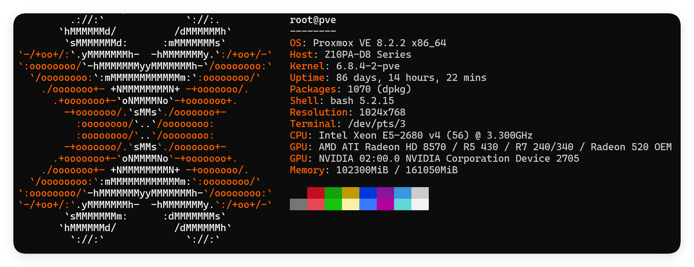
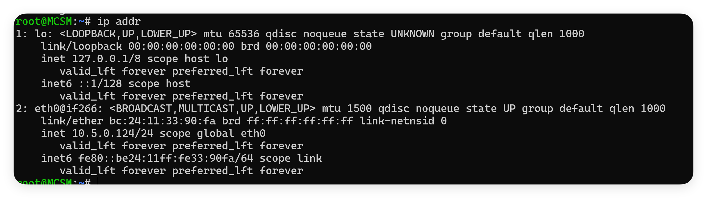
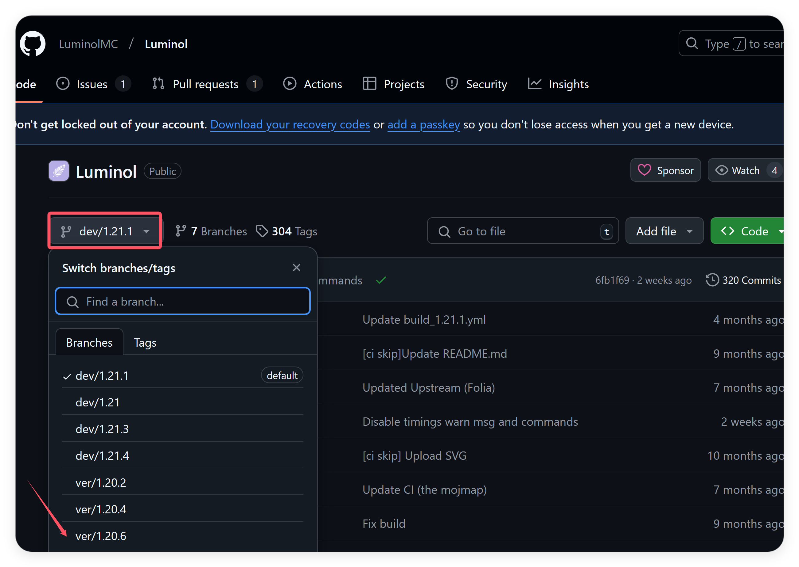
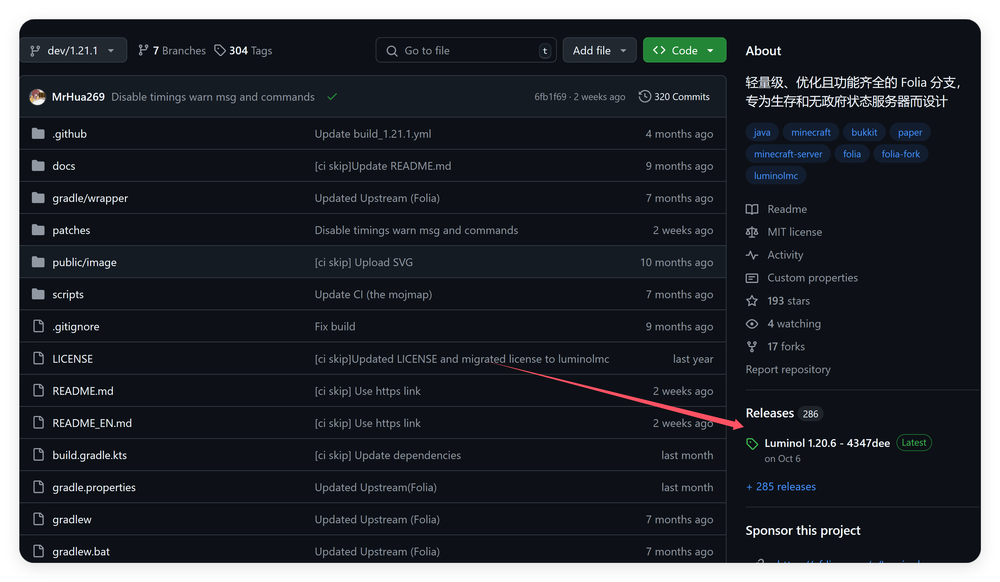
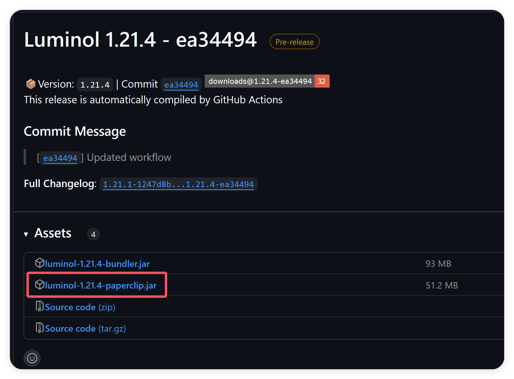

事实上，准备开始写这篇文章的时候我对MineCraft服务器的搭建一点都不熟悉，甚至还没有动手安装过任何一个插件，只和朋友一起玩过各种Forge或者Fabric服务器。但是我发现我的服务器难以承载我们的游玩，它的单核性能太弱了，我期待我们可以用极地的成本搭建一个至少流畅的服务器。这个成本有多低呢？E5-2680v4，一颗只需100个馒头。那么我们尝试搭建一下。

## 策略
- Linux 操作系统
- MCSM 守护进程
- Luminol 服务端
- 插件安装

## 平台配置说明
我的服务器使用Ubuntu进行搭建，本人对windows一点都不熟悉，希望使用windows搭建的小伙伴可以做参考。

如你们所见，我手里的其实是一台洋垃圾，但是它有不低的睿频和28核56线程，如果Folia调度足够给力的话，我应该也能流畅运行大约150名玩家。

## 使用MCSM作为守护进程
首先我们到主页[MCSManager | 开源免费，分布式，一键部署，支持 Minecraft 和 Steam游戏服务器的控制面板](https://mcsmanager.com/)找到相应的下载命令，比如我的linux就是
```bash
sudo su -c "wget -qO- https://script.mcsmanager.com/setup_cn.sh | bash"
```
MCSM使用自动安装。然后你需要找到你的机器的ip，如果你是租的服务器，你能连上它说明这个对你来说不是问题。真要查IP的话我只能给你一条指令了，看不懂也实在没办法了。
```bash
ip addr
```

我的测试机器没有公网地址，但是你得自己看懂哪个地址才能让你访问到。这里不过多赘述计网的事情。

打开你的MCSM的网络控制地址`http://<your server i>:23333`。设置管理员账号，能够访问说明你这个一步已经完成了。

## 下载Luminol服务器

首先来到Luminol的github主页
[Luminol](https://github.com/LuminolMC/Luminol)
选择想要的游戏版本对应的分支

然后点击Release：

复制需要的版本的游戏文件链接。

来到服务器，创建一个文件夹，并将刚刚复制的链接下载下来，下面是一个示例：
```bash
mkdir luminol
cd luminol
wget https://github.com/LuminolMC/Luminol/releases/download/1.21.4-ea34494/luminol-1.21.4-paperclip.jar
apt update
apt install openjdk-21-jre
java -jar luminol-1.21.4-papaerclip.jar
```
然后会自动下载游戏版本。第一次运行会直接退出，不要害怕和普通的MCServer一样，你需要修改eula的条款。
运行成功之后回到MCSM，创建一个实例，选择当前目录，再设置启动命令为上面命令的最后一条即可。
