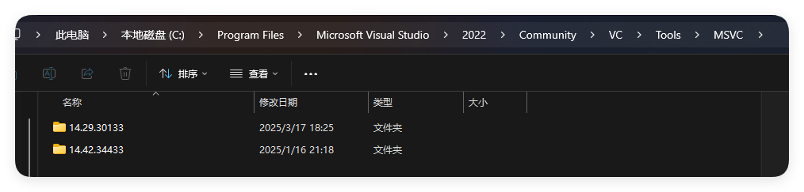
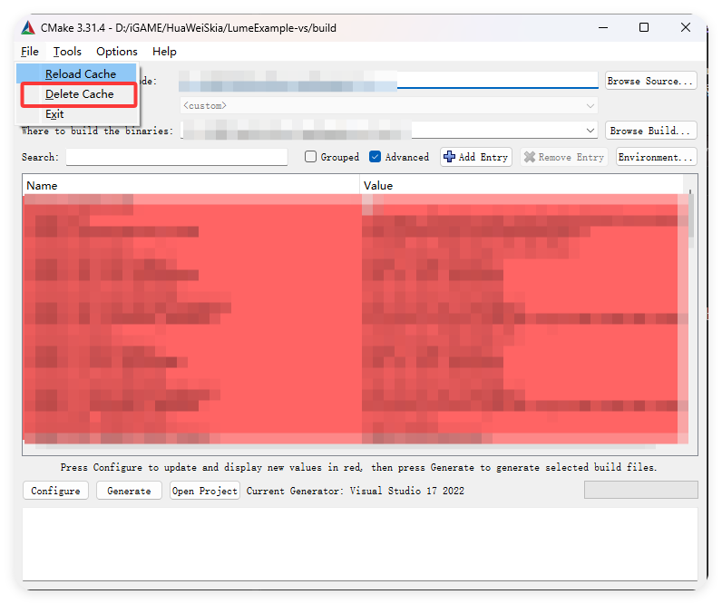
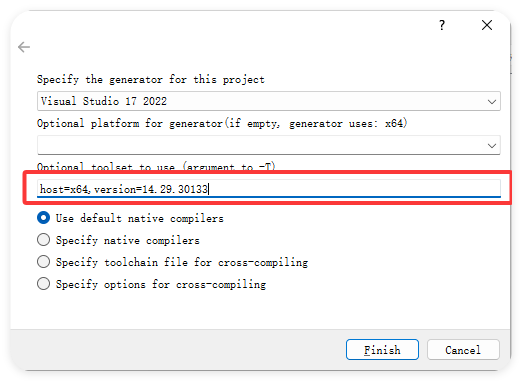

记录自己在`Visual Studio2022`中使用`Visual C++ 2019`方法。
项目使用CMake编译，但是`Visual Studio2022`默认装的是`Visual C++2022`，需要在CMake中配置编译选项，参考：[使用 CMake/MSVC 时指定工具链版本](https://www.weiran.ink/lang-c/cmake-specific-msvc-toolchain-version.html)

首先找到你的VC目录，一般在这里：`C:\Program Files\Microsoft Visual Studio\2022\Community\VC\Tools\MSVC`，然后找出你需要使用的版本，复制它的版本号（也就是文件名）

然后打开你的CMake gui，选择项目位置和输出位置，再点击清理缓存

然后点击`Configure`，第一个选择你的`Visual Studio`版本，然后下面的参数填写你要的版本，之后就可以正常构建了！

构建得到了`.sln`解决方案，再使用`VS`打开编译即可。
