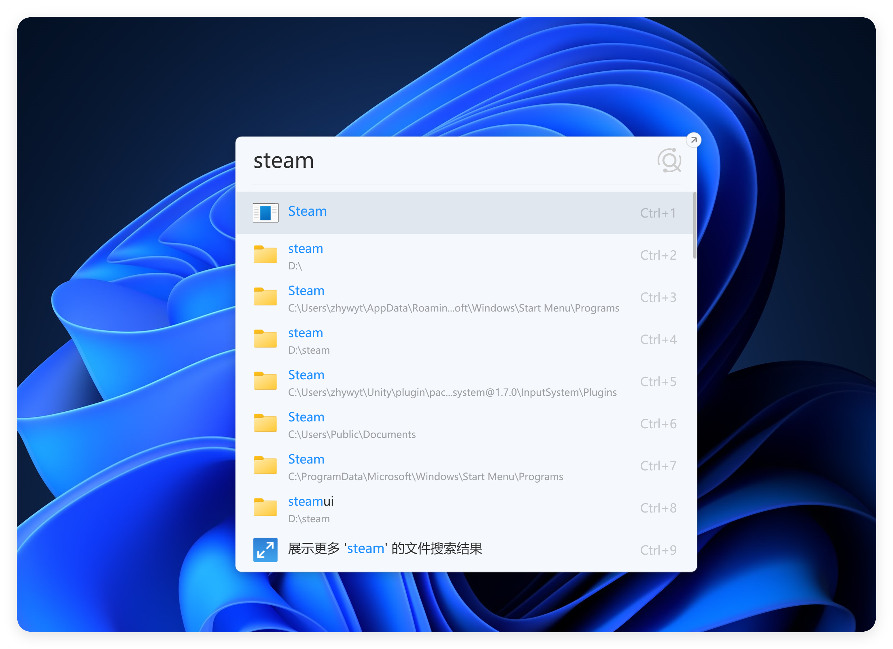
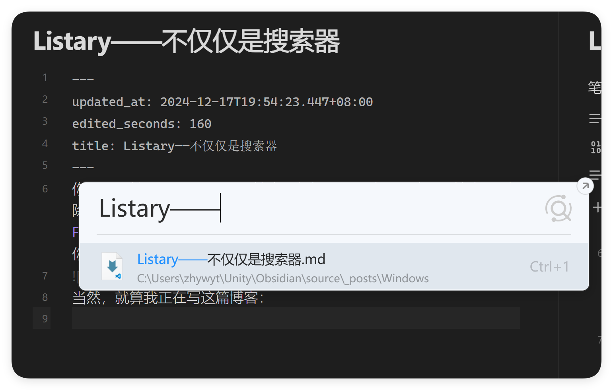
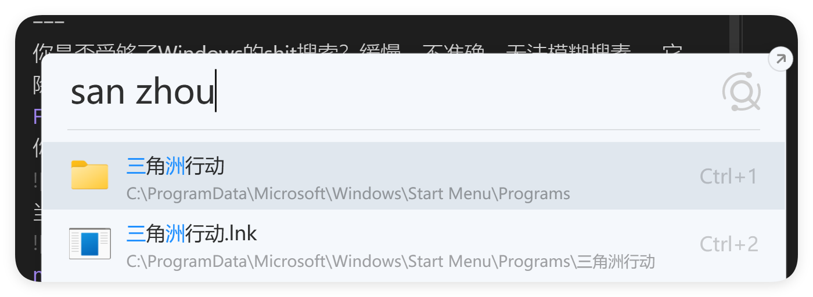
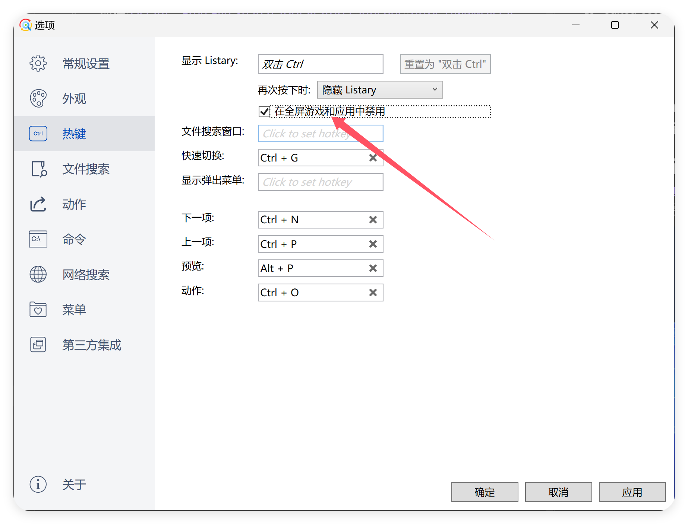
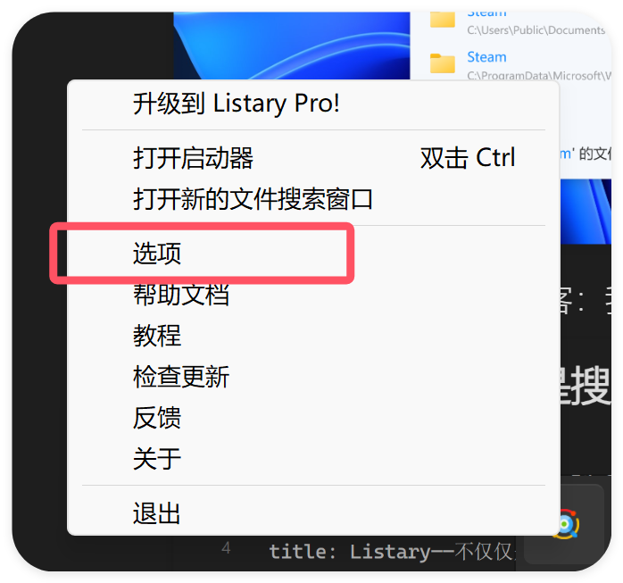
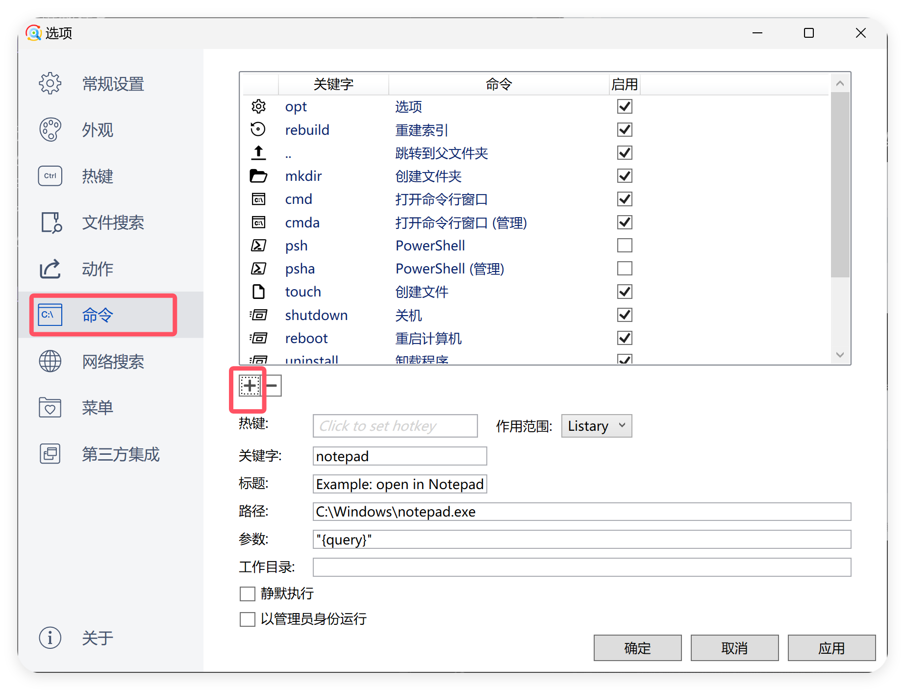

你是否受够了Windows的shit搜索？缓慢、不准确、无法模糊搜素……它除了能使用`WIN`键打开以外我找不到任何一个优点。
## 使用Listary搜索
现在[Listary – Free File Search Tool & App Launcher](https://www.listary.com/)摆在了你的眼前：只需要轻敲两次`Ctrl`键就能随时唤起你的搜索助手

当然，就算我正在写这篇博客：我也能立刻查找到它

不仅是精准的搜索，它有强大的模糊搜索能力，比如拼音

比如跨字

## 全屏屏蔽搜索设置
你可以设置在软件全局的时候屏蔽搜索

## 自定义命令
Listary给我提供了另一个无与伦比的便利——自定义命令，它可以将自定义热键绑定在你的自定义命令上！比如打开终端这件事情。在Ubuntu上，我从来都是使用`Ctrl+Alt+T`来打开终端的，但是在WIndows上，我已经受够了使用`Win+R`再加`cmd`来打开它了。这无疑是缓慢的。要设置自定义命令，你需要找到你的Listary程序，右键打开选项：

在这里，你可以非常方便的设置你的热键与对应的自定义命令：

快去尝试一下吧！使用独属于你的快捷方式！