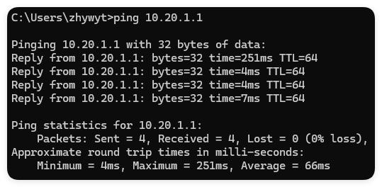
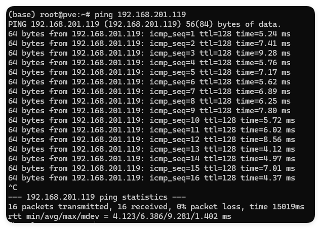

我们的许多设备如服务器、NAS、三层交换机、路由器等，都需要使用远程连接进行控制或配置。最常见的远程连接方式有**ssh连接和web服务**，而涉及到文件传输时，我们常用到的有**scp命令和rsync**。今天我们就来缕一缕这写协议与命令的使用方法。涉及到网络，会有很多细小的部分，如果出现与文中描述的不同的情况，请多思考捋清楚自己的网络环境再继续后续操作。

## 连接

最简单的部分当然是需要连接我们的设备了，在连接之前我们通常会检测与设备的联通状况。对于目标机器为`Linux`操作系统的，默认是允许进行检测的。

我们打开一个终端，使用`ping`命令来测试我们的连通性：
```bash
ping 10.20.1.1
```
这里我使用`windows`作为客户机演示了一遍：

在`windows`中，`ping`命令默认执行四次，但是在`Linux`中，默认是不断执行的：

 注意观察两次的结果，在我的内网环境中`10.20.1.1`是一台`Debian`操作系统，而`192.168.201.119`是一台`windows`操作系统，我们开可以简单的通过`ttl`来猜出他们的操作系统。下表是他们的对应关系。

| 操作系统 | 默认ttl |
| -------- | ------- |
| Windows  | 128     |
| Linux    | 64      |

在确保回执时间不长后（一般我认为100ms以下是可以接受的ssh延迟。），我们可以开始连接了。首先确保你的两台机器都安装了`openssh`服务，这一步请<font color='red'>STFW</font>。在这一步之前，你需要知道你的目标机器的IP、用户、密码（或者私钥）、开放端口号

我们需要准备
- IP（或者域名）
- 用户名
- 密码（或者私钥）
- 端口号（默认22）

### 密码连接
如果你有密码连接的需要，建议<font color='red'>不要使用密码连接你的root用户</font>。root用户默认不允许使用密码连接，这很重要。
如果能正确的控制你的权限以及网络公开范围，你可以这样开始允许密码登录：
```bash
vim /etc/ssh/sshd_config

33c33
< #PermitRootLogin yes
---
> PermitRootLogin yes
```
也就是将这一行注释取消，并改为将值改为`yes`。

| 键   | 值        |
| ---- | --------- |
| 用户 | root      |
| 密码 | password  |
| IP   | 10.20.1.1 |
| Port | 22        |

<font color='grid'>注：本机器不可访问</font>
然后使用下面的命令尝试连接：
```bash
ssh root@IP -p 22
```

如果出现让你输入密码的提示，说明连接没问题，密码正确的话就可以连接了。不建议开放密码登录的原因就在于只要密码被盗窃了，那么其他人就能快速提权，掌握你的系统。

### 密钥连接
私钥连接也是不那么安全的方法，你需要获得机器上的私钥，并使用它来连接机器。这意味着你的私钥一旦丢失，那么他人就能轻松的掌握你的系统。

首先你得获取你用户机上的公钥，使用
```bash
 ssh-keygen -t rsa
```
生成你的密钥，你可以简单的回车来创建一个没有密码的密钥，然后将`id_rsa.pub`记录下来，保存在你目标机器的`~/.ssh/authorized_keys`中，你可以直接使用文本编辑器插入其中，这是最高效的方法。你也可以使用
```bash
ssh-copy-id -i /path/to/your/pubkey user@ip
```
这个命令在`windows`下不一定可行。将你的公钥加入此文件夹后，你就可以无需密码连接该服务器了。

## 传输

传输介绍两个方法，一个是`scp`，一个是`rsync`。其实两个命令都可以基于`ssh`协议来传输，所以保证前面的连接是通畅的。

### scp

`scp`命令是非常简单的命令，几乎没有多余的话语就能将文件传输到服务器上。
现在我需要将当前目录的`test.txt`传输的目标机器的`/root/`下，我可以这么写：

```bahs
scp ./test.txt user@ip:/root/
scp user@ip:/root/test.txt .
```
你发现了，只需要在**用户-IP**段后面加上路径就行了。

对于一个递归的目录，我们可以使用`-r`参数来递归地传输：

```bash
scp -r ./test user@ip:/root/
scp -r user@ip:/root/test .
```

### rsync
`rsync`实际上是一个同步命令，但是我们经常拿它来进行远程传输，并且它支持断点重连等功能非常的好用。
详细的使用方法我推荐[rsync 用法教程 - 阮一峰的网络日志](https://www.ruanyifeng.com/blog/2020/08/rsync.html)，你可以简单的用`rsync -avz`来代替`scp`，比如：

```bash
rsync -avz ./test.txt user@ip:/root/
```


到此结束~
快去和你的机器连接吧！