2024-12-05 16:10
实际上，现在你所看到的博客是我使用hexo+Fliud主题加自己的服务器搭建起来的，那为什么又来搭建博客了？

2024-12-08 13:36
更新windows版本安装教程。

收到朱老师的要求（运动队教练），需要搭建学校运动队（定向越野队）的主页，于是想着长久为好的情况，选择了使用github来搭建，这样也方便队友们维护它。之后再写一篇博客维护交大家怎么用好了。这里顺便记录一下我们搭建<font color='yellow'>Hexo</font>的程过程，并学习一下<font color='yellow'>GitHub Page</font>的使用。

><font color='red'>我任何时候都只推荐使用Linux来搭建类似的网站。</font>

# Hexo

## Linux
### 安装Node.Js和Npm
hexo需要一些前置环境，由于它是基于Node.Js的，我们第一步就需要安装Node.Js。
```bash
sudo apt update
sudo apt install nodejs npm
```
测试：
```bash
node --version
npm --version
```
npm的安装时间可能有些久，如果网络不好请换源（STFW "ustc apt"）。这是我写这篇博客的时候的版本（2024-12-05 16:30）：
```bash
root@HDUDX:~# node --version && npm --version
v18.19.1
9.2.0
```
是的，我测试的时候使用的是`root`用户，请不要模仿我，除非你有信心修好自己的机器。


### 安装Hexo
根据[Hexo](https://hexo.io/zh-cn/)提供的命令：
```bash
npm install -g hexo-cli
```
我自然是全局安装，因为我使用的是容器开发。如果你介意全局安装你可以参考官网的局部安装，对后续不会产生影响。

测试Hexo：
```bash
root@HDUDX:~# hexo --version
hexo-cli: 4.3.2
os: linux 6.8.4-2-pve Ubuntu 22.04 LTS 22.04 (Jammy Jellyfish)
node: 18.19.1
acorn: 8.8.1
ada: 2.7.2
ares: 1.27.0
base64: 0.5.0
brotli: 1.0.9
cjs_module_lexer: 1.2.3
cldr: 44.1
icu: 74.2
llhttp: 6.1.0
modules: 109
napi: 9
nghttp2: 1.59.0
openssl: 3.0.13
simdutf: 3.2.18
tz: 2022a
unicode: 15.1
uv: 1.48.0
uvwasi: 0.0.19
v8: 10.2.154.26-node.28
zlib: 1.3
```
## Windows(失败)

### 安装 Node.Js
[Site Unreachable](https://nodejs.org/en/download/package-manager)

选择安装程序安装：
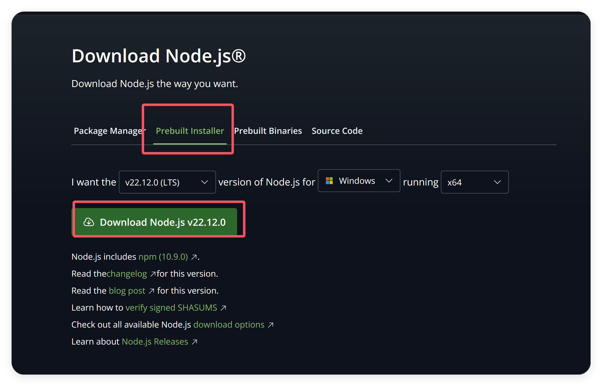
安装你想要的版本，最好选择最新的LTS版本，下载好后运行安装即可。
```powershell
npm.cmd --version
```

### 安装Hexo

```powershell
npm.cmd install hexo-cli -g
```
这一步我等了很久，失败乐，Windows还是别用了。我受不了了。


## 创建第一个站点！

使用以下指令来创建一个站点，它会在当前文件夹下生成同名文件夹：
```bash
hexo init <Your site name>
```
Nodejs比较慢，你可以尝试代理或者其他方式来加速。成功了像这样：
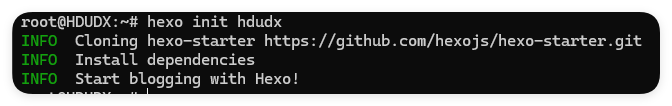
然后进入站点，安装依赖：
```bash
cd <Your site name>
npm install
```
项目里会有这么一些东西，我稍微介绍一下，之后可以自行深入了解：
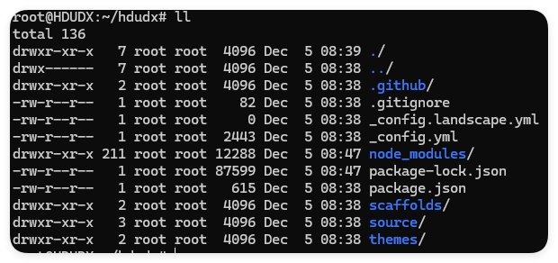

- `_config.landscape.yml`
	- 我们的初始主题叫`landscape`，这是主题的配置文件
- `_config.yml`
	- 这是hexo的配置文件
- `node_modules`
	- 这是node.js的包
- `source`
	- 这是您的md文件，会以page的形式组织，特殊的`_posts`是您的所有博客文件
- `themes`
	- 这是主题文件夹，下载的主题放在里面
- `public`
	- 这个文件夹你可能还没有，这是生成的前端文件，主要是html和css

## 本地部署测试
```bash
// 生成命令，将你的md文件编译成前端文件
hexo g
// 启动服务命令，启动apache，在你的4000端口开发服务
hexo s
```

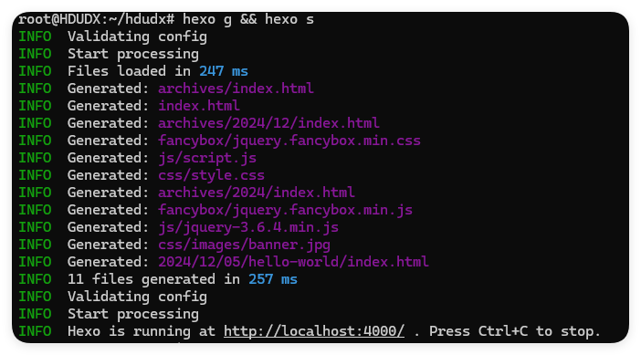

你可以访问本地的`http://localhost:4000`，使用`Ctrl + C`中止它，这不是我们的目的。


# Github
## 申请Github组织

相信你自己的Page肯定已经部署了其他服务了，对于组织类型的站点，我们可以使用组织的子域名来做。
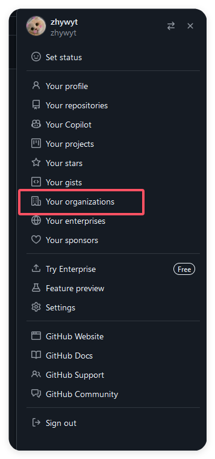
找到组织页面，创建一个新的组织，名字依据你们组织来定，我为杭电定向队创建：
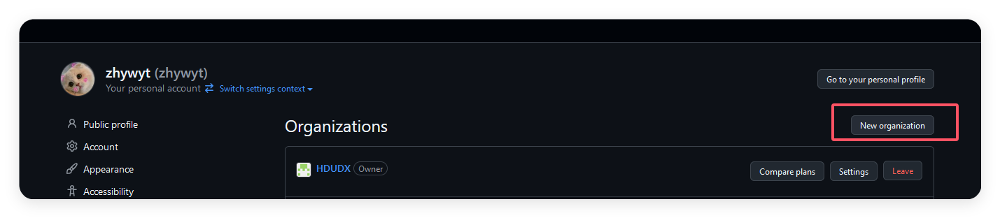
## 创建同名项目
我们暂时跳过加入成员的过程，在组织下创建一个同名项目：
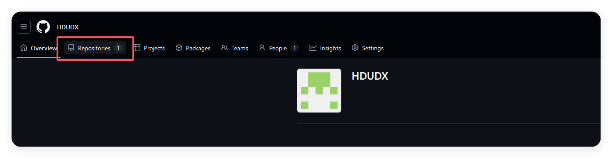
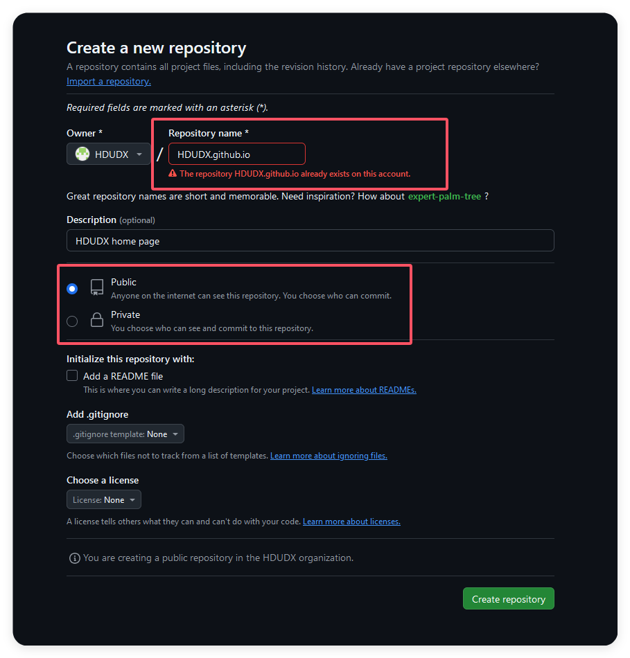
需要注意的是你的仓库名设置为`<组织名>.github.io`，这与你的page类似。然后设置为公开的。

# Hexo + Github

## 远程插件
我们需要一个插件来帮我们一键同步到github仓库中，我们安装这个插件：
```bash
npm install hexo-deployer-git --save
```

然后我们修改以下`_congig.yml`文件，使用你自己熟悉的文本编辑器打开它：
```bash
vim _config.yml
```
找到`# Deployment`项，它应该在最底部，修改信息：
```yml
# Deployment
## Docs: https://hexo.io/docs/one-command-deployment
deploy:
  type: 'git'
  repository: <Your project url>
  branch: master
```
## 创建我们的ssh-key
使用以下命令创建key，并一路回车。
```bash
root@HDUDX:~/hdudx# ssh-keygen
```
你的key会生成在`~/.ssh/`下，找到pubkey。你可以使用你喜欢的方式查看它：
```bash
cat ~/.ssh/id_rsa.pub
```

## 打开DeployKey并设置
找到你的组织的设置->DeployKeys->Enable->Save
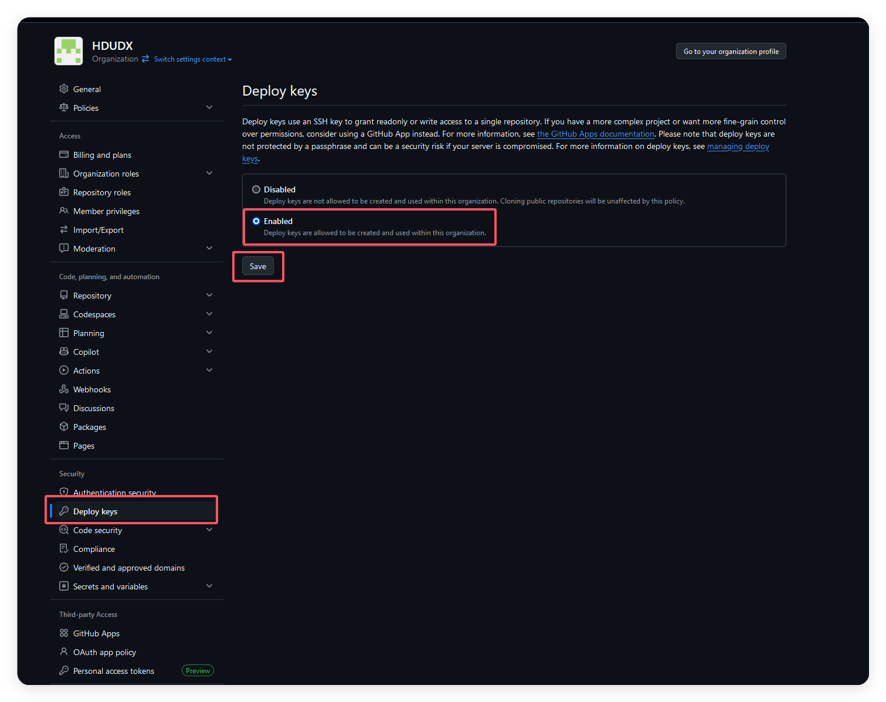
我们打开这个，就不需要将机器的ssh key放在我们的用户信用名单中，而可以对单个项目进行配置，这非常好。打开之后找到我们的项目的设置：
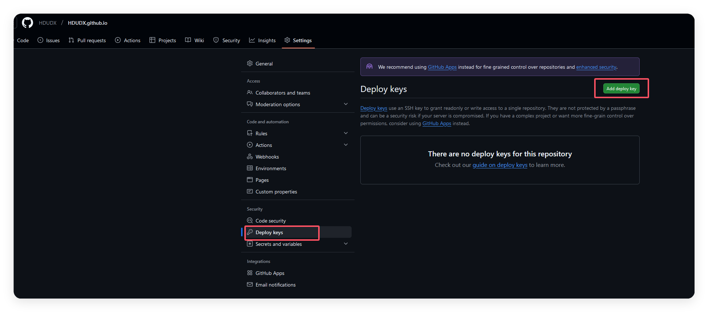
将我们机器的公钥填入，并勾选允许写访问
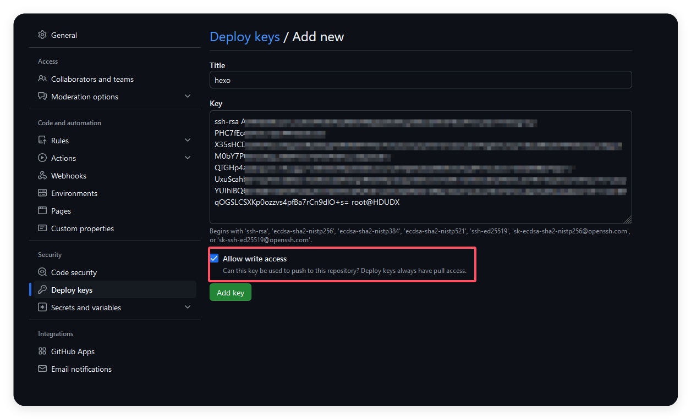

## 一键部署
然后我们回到机器，尝试运行部署指令：
```bash
hexo d
```
如果出现这样的问题：
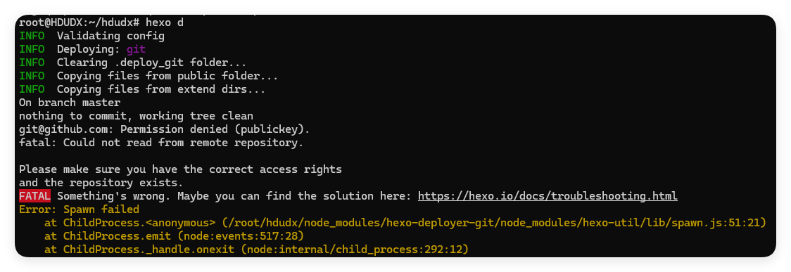
请检查你的key是否设置正确，正确的运行结果类似这样：
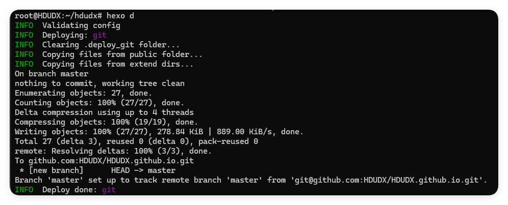

然后检查我们的仓库时候已经有了文件：
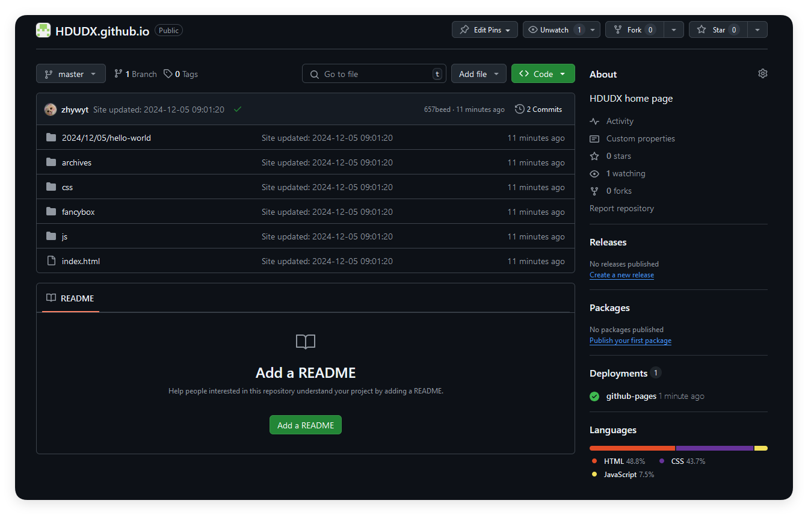
此时你迫不及待地打开专属你的网址，可能出现<font color='red'>404</font>，不要沮丧，打开你的项目设置，找到`Pages`，选择正确的分支和文件夹，并保存。不出意外的话在1分钟后就会得到正确的结果了！可以尝试访问我们的网站：[杭州电子科技大学定向队](https://hdudx.github.io)。
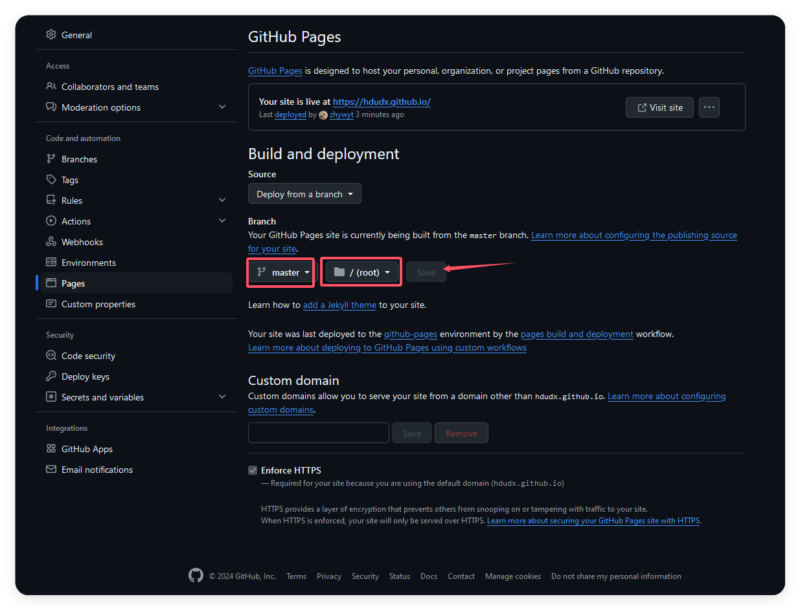

# 主题选择

 首先去官网找主题[Themes | Hexo](https://hexo.io/themes/)（PS：主题来自社区，Hexo不保证其安全性）。

## 推荐主题
[GitHub - Yue-plus/hexo-theme-arknights: 明日方舟罗德岛阵营的 Hexo 主题，支持数学公式、Valine&Gitalk&Waline评论系统、Mermaid图表](https://github.com/Yue-plus/hexo-theme-arknights)
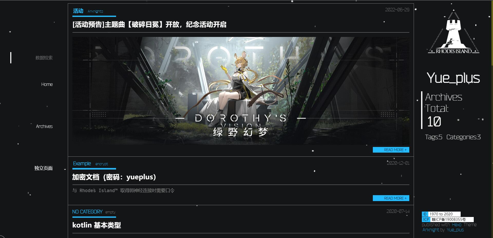

[GitHub - xaoxuu/hexo-theme-stellar: 内置文档系统的简约商务风Hexo主题，支持大量的标签组件和动态数据组件。](https://github.com/xaoxuu/hexo-theme-stellar)
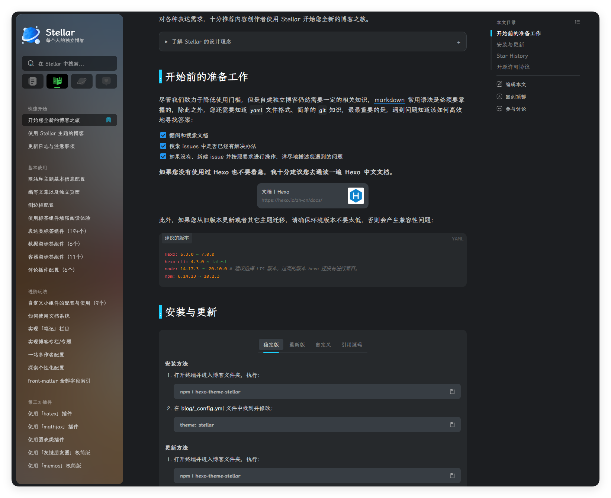

2024-12-05 18:21 
快照，看看我两个多小时的成果：
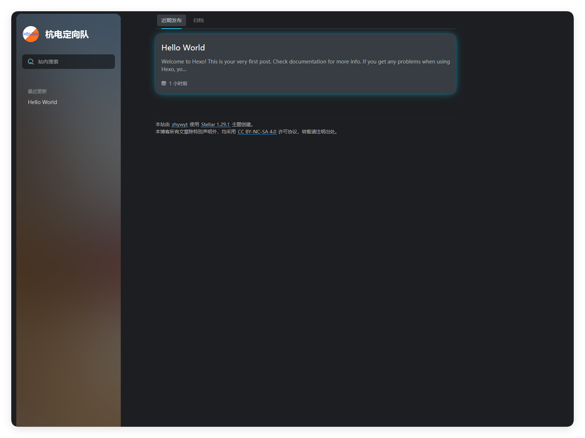
# 源码/前端分家

我们使用`hexo d`实现的其实只是将我们的`public`里的文件上传到github上，但是我们的`Markdown`文件其实无法保存在云端，这个时候就有一个天才站出来了，说：我们用两个分支，分别存储源码和前端不就好了吗？于是这个解决办法就这样孕育而生了：
