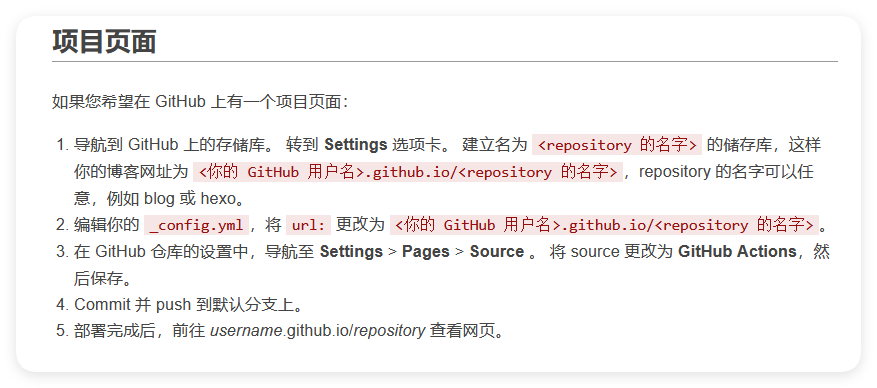

最近在捣鼓各种hexo主题，发现一个难过的问题，在github中的组织内启用非组织同名仓库的时候会得到类似`https://domain.github.io/repo`的根站点，这导致了我大量的图片无法正常渲染，也出现了很多css无法访问的情况，这里来记录一下。并探索解决方法。

如果直接按照hexo文档的方式搭建
[在 GitHub Pages 上部署 Hexo \| Hexo](https://hexo.io/zh-cn/docs/github-pages)

那么我会得到一个
✔️
- 页面正常
- 路由正常
- CSS正常
- 主题路径路由正常

✖️
- 博客部分图片路由错误

我没办法解决这个问题！！