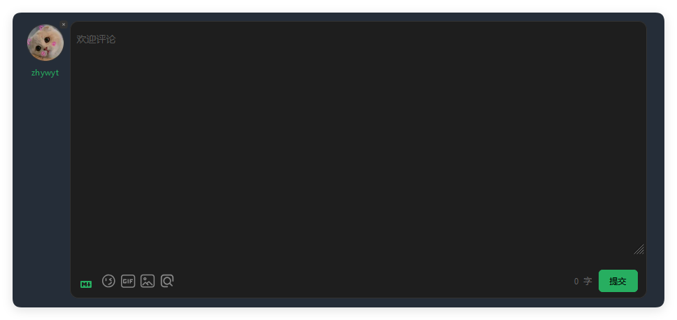
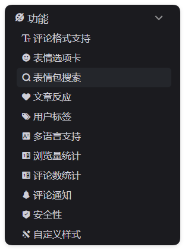

我的hexo是私有部署，没有使用github的评论系统。使用[waline](https://waline.js.org/)作为评论系统，mysql作为后端数据库。
主要由两部分组成：
## 数据库
使用mysql简单部署，首先去这里下载[waline.sql](https://github.com/walinejs/waline/blob/main/assets/waline.sql)，保存到你自己的目录下，我取名为waline.sql，记住这个文件的路径，然后执行下面的语句。请将下面的`<path/to/your/waline.sql>`替换为你下载的文件的路径，请使用绝对路径。关于mysql客户端协议问题参考[^1]
```bash
sudo apt install mysql-server
mysql
# 需要解决Node.js mysql客户端不支持认证协议引起的错误，所以重新添加一个用户
alter user 'root'@'localhost' identified with mysql_native_password by '123456';
create database waline;
\u waline
source <path/to/your/waline.sql>
show tables;
\q
```

其中，最后`show tables;`的结果应该如下：
```sql
mysql> show tables
    -> ;
+------------------+
| Tables_in_waline |
+------------------+
| wl_Comment       |
| wl_Counter       |
| wl_Users         |
+------------------+
3 rows in set (0.00 sec)
```
由apt安装的mysql数据库，默认的用户密码保存在：`/etc/mysql/debian.cnf`。
这里设置了`root`用户之后，下次登录需要使用密码登录：
```bash
mysql -p
Enter password: 123456
```

## waline后端

安装好mysql后，我们需要为waline后端配置一些环境变量，你可以将这些写在你的`~/.bashrc`中，他们会在你打开终端的时候运行。[^2]
```bash
echo 'export MYSQL_DB=waline
export MYSQL_USER=root
export MYSQL_PASSWORD=123456' >> ~/.bashrc
source ~/.bashrc
```

检查环境变量：
```bash
env | grep SQL
```
如果能看到上面添加的几个值说明成功了。
最后一步是最简单的，我们使用[独立部署](https://waline.js.org/guide/deploy/vps.html)作为参考：
```bash
npm install @waline/vercel
node node_modules/@waline/vercel/vanilla.js
```
第二条命令就能把后端服务启动，只要你正确配置了环境变量，就能成功将后端运行起来。

## fliud配置
首先你来配置评论系统了，肯定已经对`fliud`有了一定的了解了，我需要你能找到它的配置文件所在的位置。打开它
```bash
vim _config.fliud.yml
```
搜索`waline`找到这一段：


```yml
# Waline
# 从 Valine 衍生而来，额外增加了服务端和多种功能
# Derived from Valine, with self-hosted service and new features
# See: https://waline.js.org/
waline:
  serverURL: ''
  path: window.location.pathname
  meta: ['nick', 'mail', 'link']
  requiredMeta: ['nick']
  lang: 'zh-CN'
  emoji: ['https://cdn.jsdelivr.net/gh/walinejs/emojis/weibo']
  dark: 'html[data-user-color-scheme="dark"]'
  wordLimit: 0
  pageSize: 10
```

需要启动它你只需要填入`serverURL`字段即可，而且需要保证访问博客的人能正常访问到这个`serverURL`，所以你的`waline`也需要内网穿透并反向代理绑定域名，这部分自行处理。如果有网络的困难的话，请先本地游玩体验。等待网络技巧提升再来尝试。
然后需要启动评论系统，搜索`comments`，找到如下内容<font color='red'>对于不同的page这个评论组件是分开的，如果你需要在文章中使用评论组件，需要在post下面找到这个，如果需要在友链中使用同理。</font>：
```yml
  # 评论插件
  # Comment plugin
  comments:
    enable: true
    # 指定的插件，需要同时设置对应插件的必要参数
    # The specified plugin needs to set the necessary parameters at the same time
    # Options: utterances | disqus | gitalk | valine | waline | changyan | livere | remark42 | twikoo | cusdis | giscus | discuss
    type: disqus
```
将`type`字段改为`waline`，并确保`enable`字段为`true`。这可以保证你的评论是启动的，并使用`waline`配置。

配置好后，重启heox服务：
```bash
hexo clean && hexo g && hexo s
```

不出意外你可以在你设置的界面看到如下内容：



不过我这里已经登录了，建议使用github登录，首次创建的账号是站主账号。到这里基础的`waline`搭建就结束了，但是其实`waline`还有很多好玩的东西，之后搭建了可以在这里补充~

[waline功能](https://waline.js.org/guide/features/)


## reference

[^1]:[# 解决Node.js mysql客户端不支持认证协议引发的“ER_NOT_SUPPORTED_AUTH_MODE”问题](https://blog.csdn.net/kkkloveyou/article/details/91623834)

[^2]:[waline多数据库支持mysql篇](https://waline.js.org/guide/database.html#mysql)

