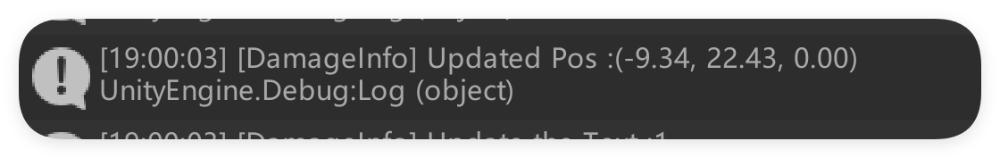
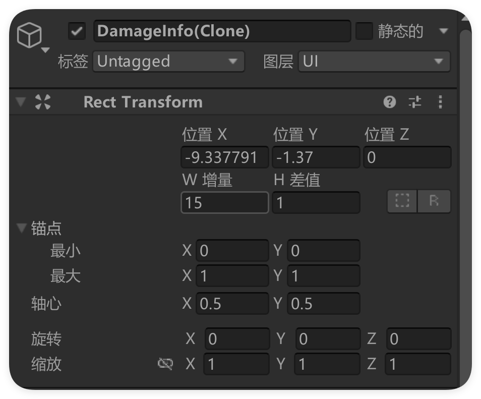
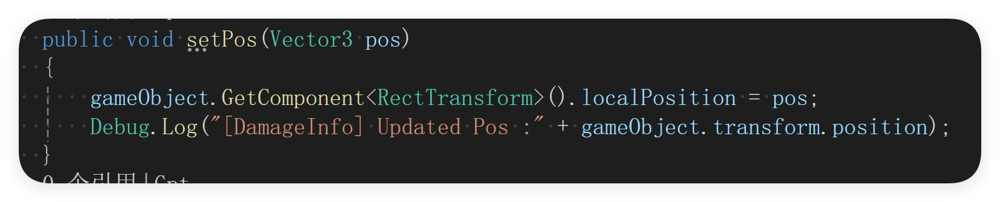
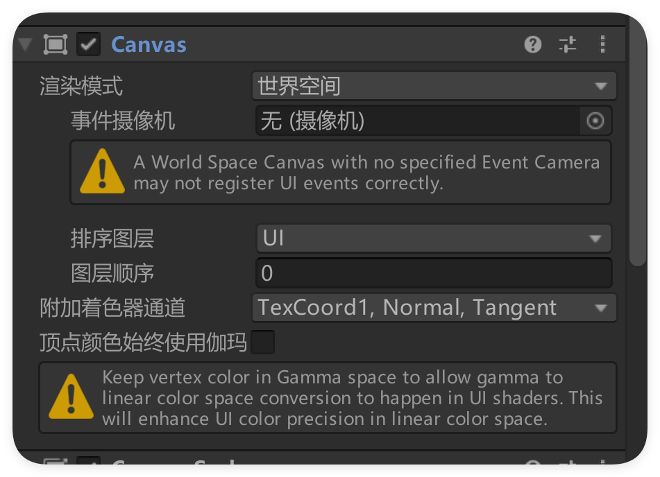

我希望实现一个攻击的伤害反馈，在我写好伤害显示的脚本之后，我发现了一个奇怪的问题。我的伤害字体的位置与我设置的不一致，我尝试在内存中读取它设置后的位置，竟然和我设置的一样，但是在Unity中显示的不一样。并且只有y轴不同：

我的代码如下：

我觉得我需要阅读一下`Rect Postition`类的定义了。并且我可以排除是`Canvas`的问题，我的`Canvas`是设置在物体上的，并且模式为世界模式。

最后发现是动画里记录了世界坐标的位置，所以每次生成会在世界坐标，导致我一直以为x是对的，没办法做出正确的判断。解决办法很简单，只需要给该物体添加一个父物体就可以了，唯一需要注意的是需要将销毁代码绑定到父物体上。