# 触发器设计
对于存在剧情以及玩家交互的触发器，我们一定存在一个任务作为导向，所以我将这类存在任务的触发器作为了一个抽象类`Warnner`封装，并设计了三个特殊的预制体与之相搭配使用。所有的触发物只有设置了`Inter`tag才能被全局索引到。
## 触发器分类依据

我将触发器分为了四类：
- 直接触发物  Direct
	- 无需碰撞检测，进入场景即尝试触发。
- 碰撞触发物 Trigger
	-  只检测碰撞，碰撞发生即尝试触发。
- 主动触发物 Active
	- 检测碰撞并等待玩家交互，碰撞后等待玩家交互，碰撞结束停止监听。
- 基本触发物 Inter
	- 无交互，可以设置是否初始激活、可以被当前场景索引

### 直接触发物
WarnnerType : DirectInteration
需要配置的内容有：

| TaskId | DelSelf   |
| ------ | --------- |
| 任务ID   | 触发后是否deActive自己 |

特殊的，直接触发物，无需配置碰撞体积，只需要放在对应场景即可。会在玩家加载场景后不断检测触发，除非有 DelSelf 为 true 或者RejectKey是GiveKey的子集。

### 碰撞触发物
WarnnerType : TriggerInteraction
相比直接触发物，需要配置一个Collider2D的碰撞体，并设置为Trigger，我为设置了一个Box Collider2D的预制体，如果需要可以设置为其他碰撞体（Box、Circle、Capsule），不会影响脚本效果。需要配置的内容有：

| TaskId | DelSelf         | WarnIfTheKeyIsNotEnough | Collider2D碰撞体(Trigger) |
| ------ | --------------- | ----------------------- | ---------------------- |
| 任务ID   | 触发后是否deActive自己 | 是否在检查物不足的时候提醒玩家         | 请务必设置为Trigger          |

### 主动触发物
WarnnerType : ActiveInteraction
主动触发物是最复杂的触发物，需要配置一个Collider2D的碰撞体，并设置为Trigger，同时可以为该触发物配置一个`Question`子物体，会在玩家进入碰撞范围的时候将该物体激活，并播放动画（默认动画）。需要配置内容：

| TaskId | DelSelf            | WarnIfTheKeyIsNotEnough        | Question子物体             | Collider2D碰撞体(Trigger) |
| ------ | ------------------ | ------------------------------ | -------------------------- | ------------------------- |
| 任务ID | 触发后是否deActive自己 | 是否在检查物不足的时候提醒玩家 | 可选（提醒物）使用名字索引 | 请务必设置为Trigger       |

### 基本触发物
使用脚本`Inter`。
基本由于我发现部分触发物不存在任务，并且想要实现场景逻辑需要一部分可索引但是不需要任务的物体（被任务触发物调用），所以我编写了一个基类当作基本触发物，只有`触发物id`和`是否在起始投放属性`，并且可以被全局索引到，可以满足关卡的编辑，比如我们的藤曼、大门等等。基本触发物只需要设置`触发物id`即可，系统会从数据库中读取另外一个属性。需要配置内容：

| InterId                           |
| --------------------------------- |
| 触发物Id |

特别注意的是，这里配置的不是任务ID，而是触发物ID。

## 触发物补充说明
Unity的场景加载会重置场景中的所有的信息，也就是说触发物状态也会重置，会导致如果以当前策划表格进行编写的话会出现大量重复的剧情播放，所以需要策划老师辛苦将只需要单次播放的任务或者触发物使用check&reject系统隔离开，比如只触发一次就拒绝本任务发放给玩家的物品。

# 例子
这是目前的所有触发器预制体，我会介绍每一个预制体的使用方法以及对场景的设计思考。
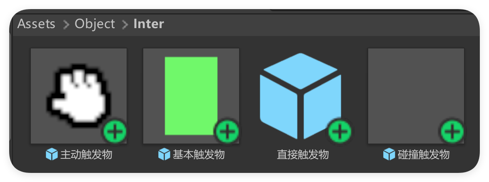
我会以一个具体的例子来使用到所有的触发器，以便后续使用。

## 场景说明
我们简单地布置这样一个场景：
- 进入场景播放一段CG
- 场景内存在一个必须触发的物体，且需要玩家发现并交互（非碰撞需求）
- 场景内存在一个需要玩家碰撞触发的物体
- 一个影响玩家移动区域的障碍触发物

这里就对应了我们的四种触发器，进入场景直接播放CG我们可以使用直接触发器来实现，需要玩家寻找的触发器我们可以使用主动触发器来实现，需要碰撞直接触发的物体，我们使用碰撞触发器来实现，而最后一个只影响玩家移动的“障碍物”，但是需要为剧情服务的时候，我们可以使用基本触发物来实现。

### 直接触发物实例
我们直接放置一个直接触发物在场景中，无需为它设置渲染。并为它配置任务ID即可。
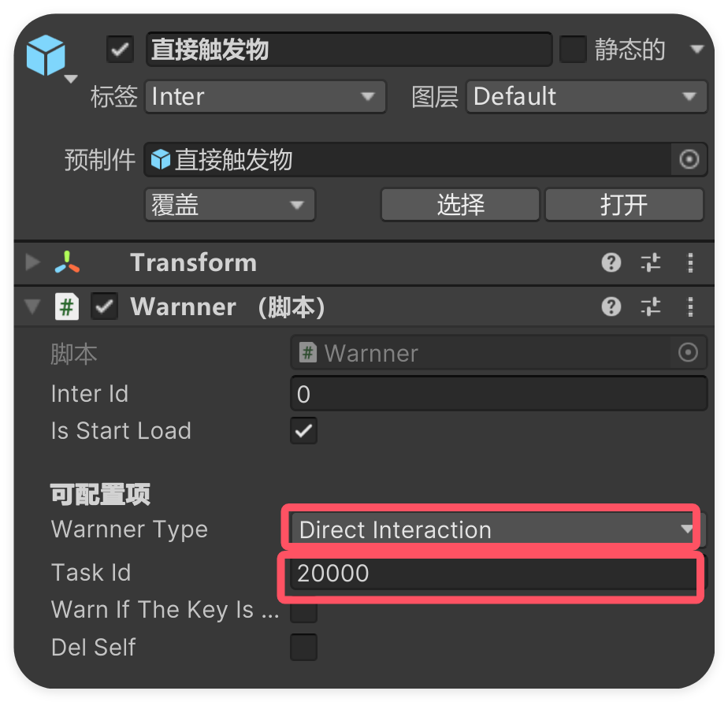
### 主动触发物实例
对于第二个主动触发器，使用主动触发器预制体，默认配置了一个圆形碰撞体：
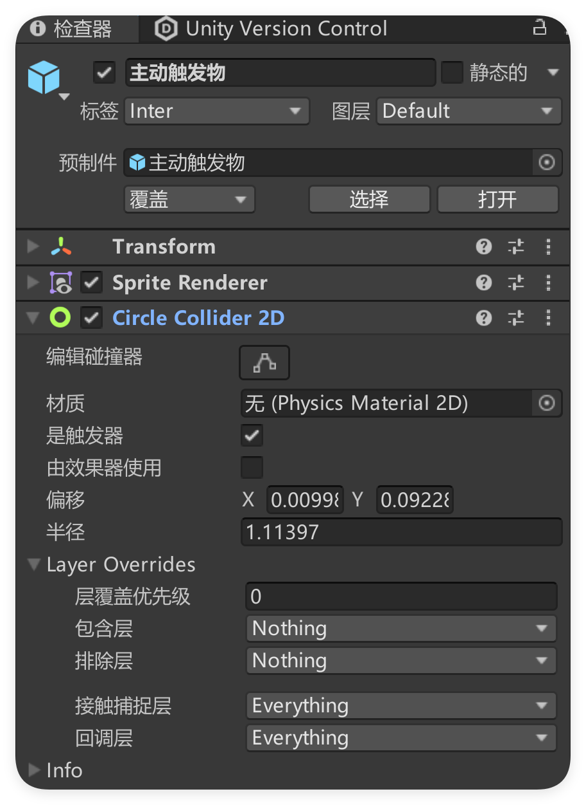
可以点击编辑碰撞体按钮来调整触发物的响应区域。
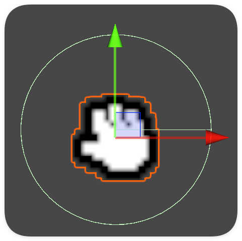
如果需要其他类型的碰撞体，可以先删掉这个碰撞体
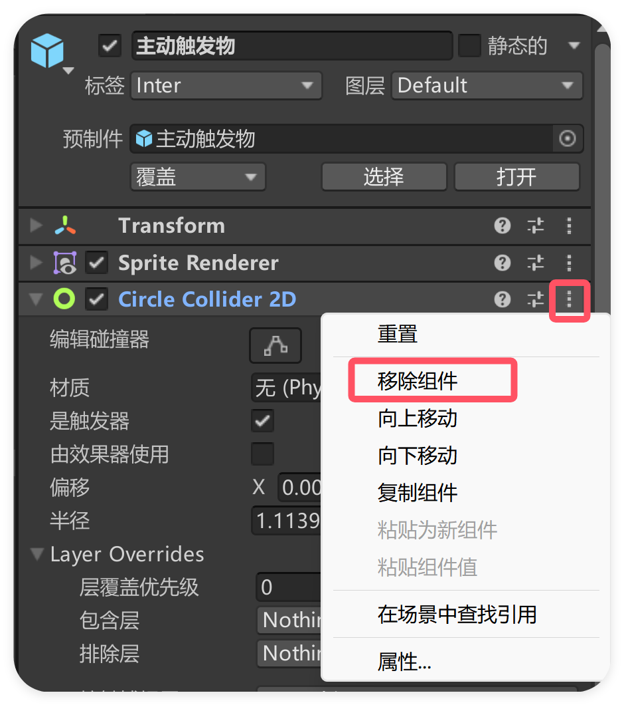
然后添加一个新的碰撞体，在检查器（Unity的物品检查器）的最下方找到添加组件，搜索`Collider 2D`选择想要的类型添加，并设置为触发器：
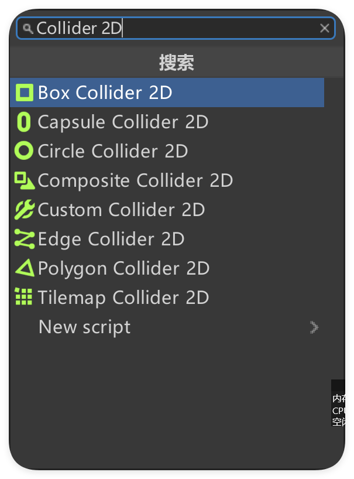
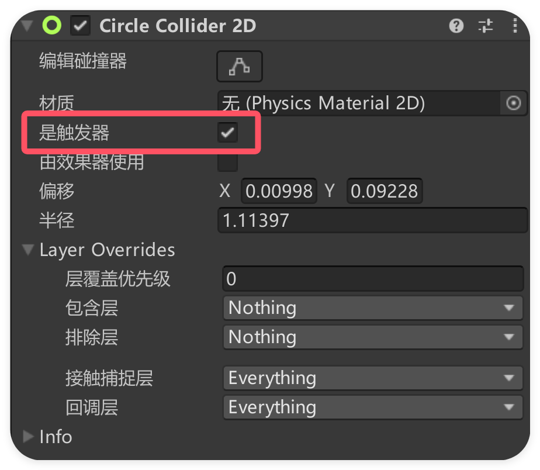
然后检查触Warnner脚本中的发器类型、设置任务ID，特别的，这里可以勾选是否提醒、是否deActive自己（触发后）。
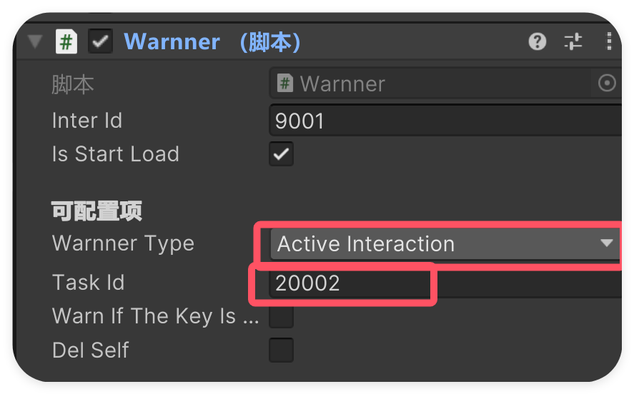
最后是可选的`Question`物体，默认的主动触发物是配置了一个子物体的，但是默认是未激活的，如果想要预览它，可以勾选激活，这样就能看到该物体了。
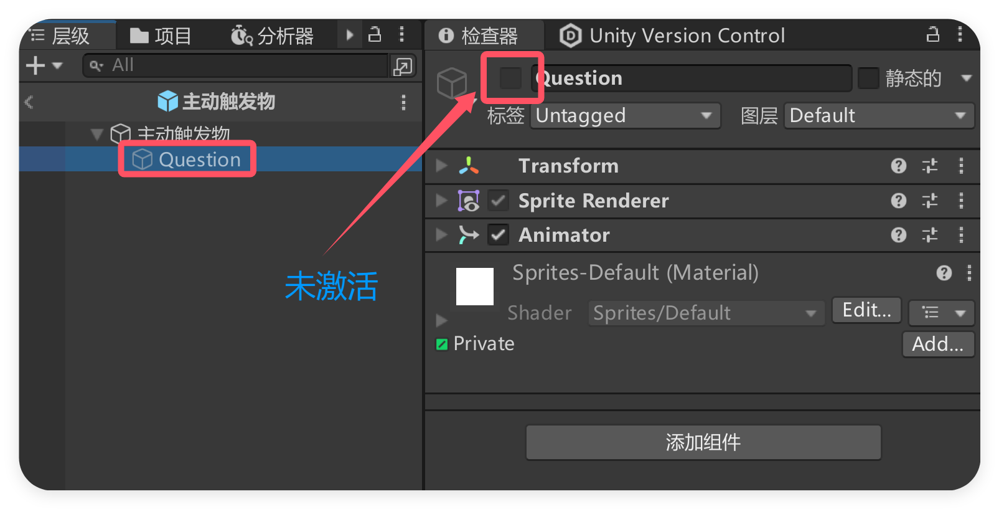
在选中Question的情况下，你可以找到动画窗口，创建新的动画。动画请保存在`\Assets\Animation\warnning\`下。
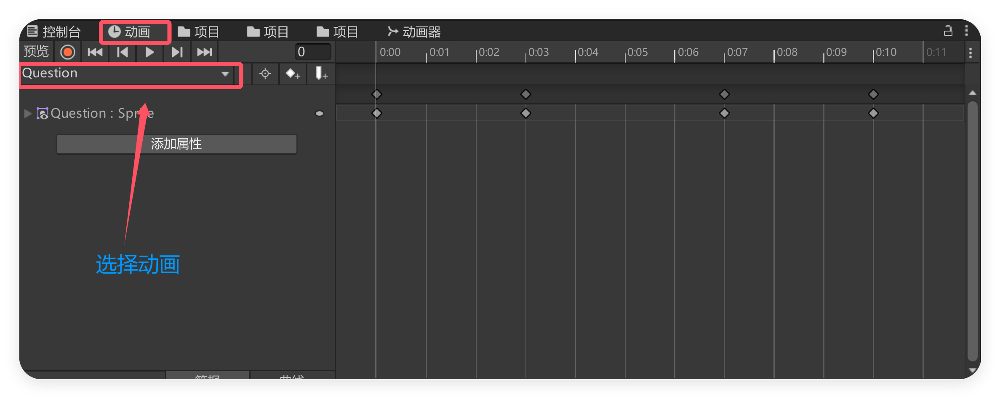
### 碰撞触发物实例
碰撞触发物体很多时候都不需要渲染，比如我们的门、检查物等等。但是我们还是需要一个碰撞体来检测玩家的进入：
加入一个碰撞触发物，默认是没有渲染的，但是我们在编辑器中可以看到它的碰撞体：
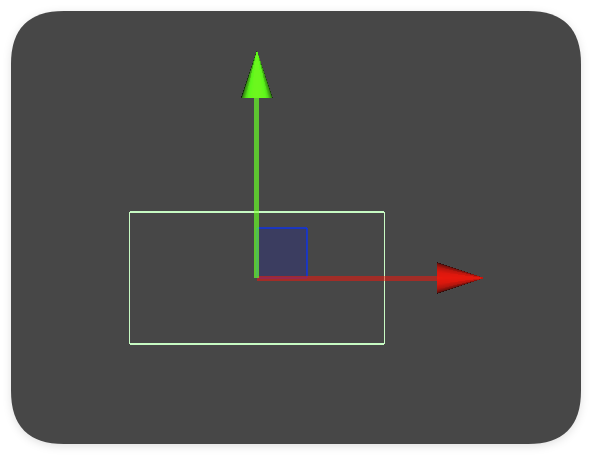
这个绿色的框是它的碰撞体积，同理，碰撞触发物也可以更换碰撞体，更换方式和主动触发物相同。
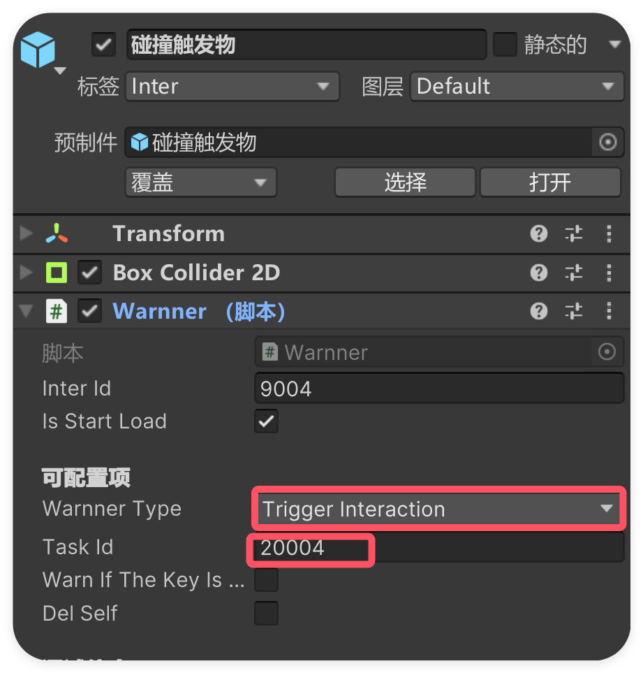
配置也和主动触发物类似。

###  基本触发物实例
基本触发物体比较简单，一般设置为静态物体，不允许移动，并将碰撞体的“触发物”选项取消。（默认的预制体已经配置好了这些）
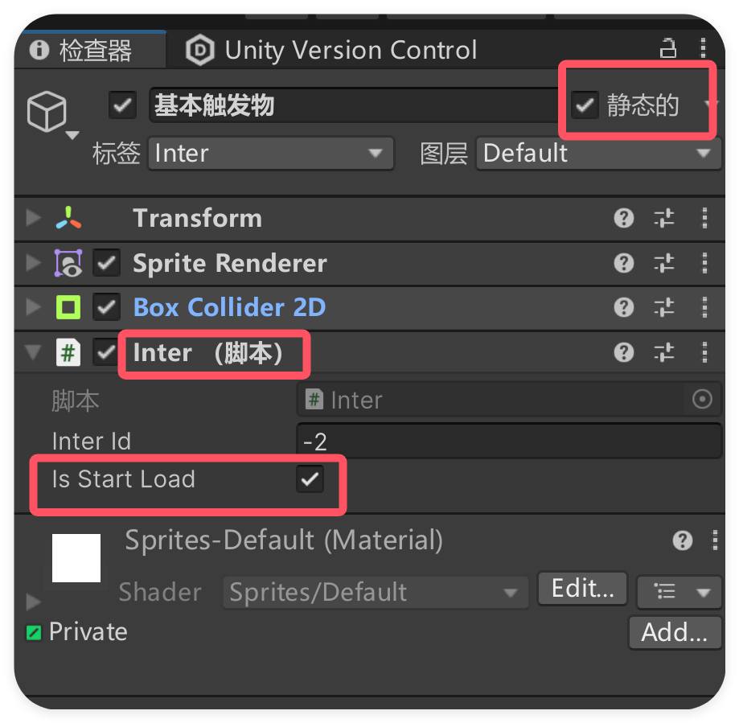
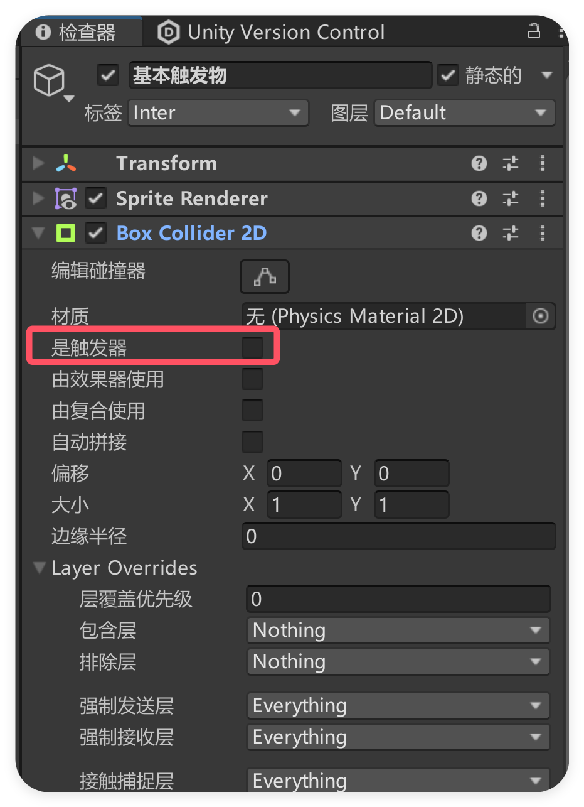
然后可以只需要设置`Inter Id`即可。

# 预制体说明
Unity中的预制体是一种类似于基类的存在，从项目窗口中将`预制体`拖入场景，就会生成一个预制体变体，所有的预制体变体会随着基础预制体的改变而改变，但是基类不会反向改变，在层级窗口中，蓝色的是指预制体变体，每个变体的右边会有一个小箭头，点击就可以修改该预制体变体对应的预制体，你可以在这里修改该预制体，并影响所有的预制体变体。创建预制体的方式就是将层级窗口的物体拖入项目窗口。
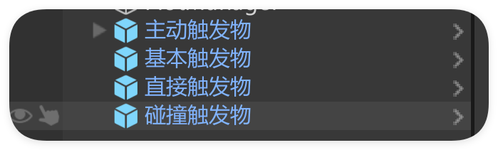
