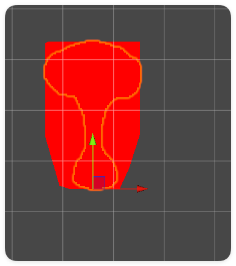
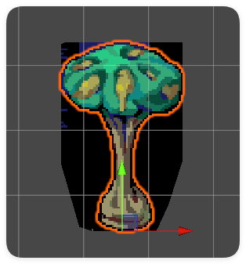
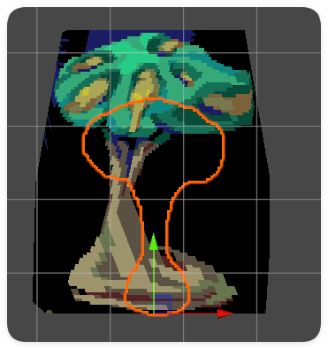
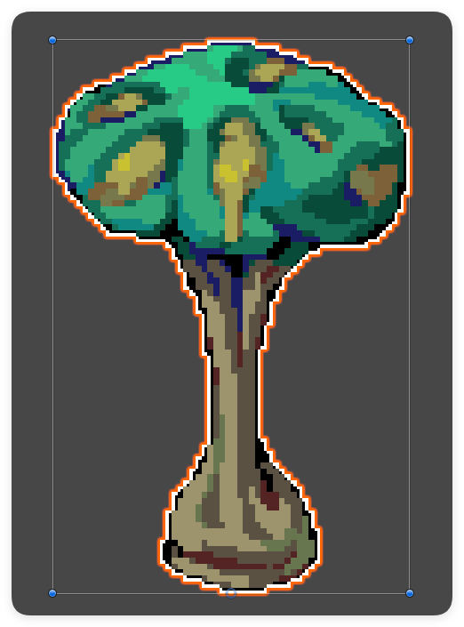
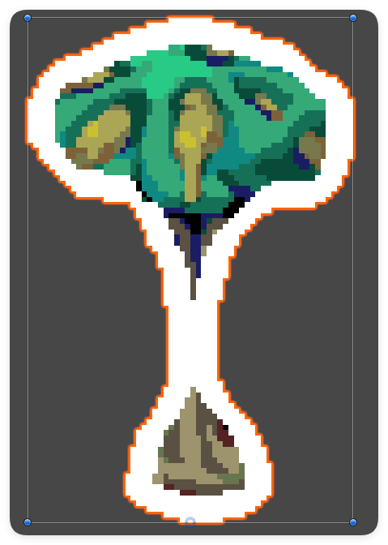
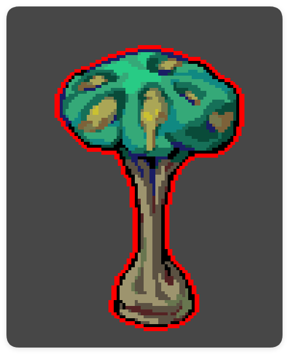
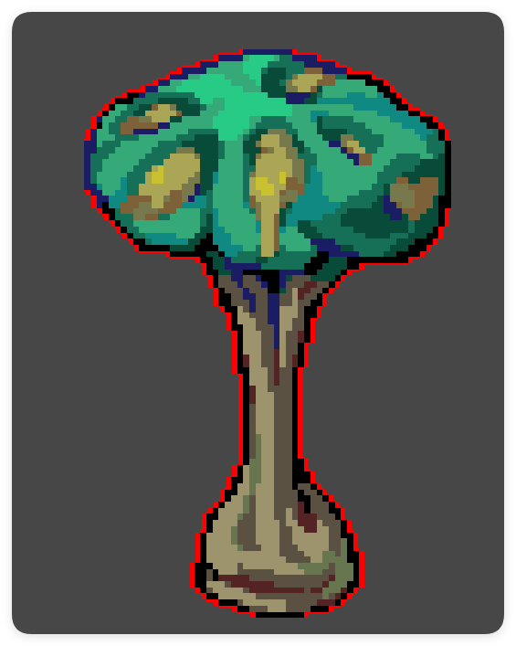
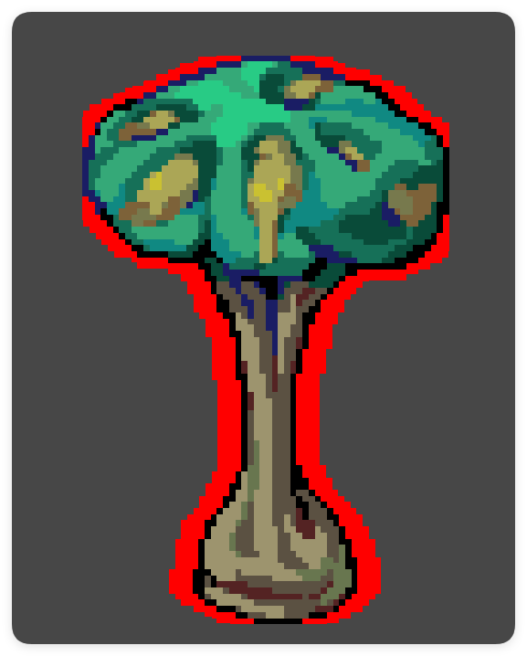

我看到过很多角色描边的博客，大部分在讲3D的角色描边，在3D的情况下，最好的办法就是使用法线外扩+两次Pass来实现描边。简单来说就是因为模型有法线，那么顶点就会有法向，可以直接向外扩展部分，并额外渲染一个描边色的、不带正面的描边层，然后正常使用第二个Pass渲染模型本身就可以了。

而在2D中，没有模型，只有图片，并且图片也不存在硬边界，大部分的图片都是由一个简单的多边形加上扣掉无用的点组成的，这里给一个简单的例子来说明：
```csharp
Shader "Hidden/test"
{
    Properties
    {
        _MainTex ("Texture", 2D) = "white" {}
    }
    SubShader
    {
        Cull Off ZWrite Off ZTest Always
        Tags { "Queue" = "Transparent" }
        Pass//---------------------------渲染图片边框-----------------------------
        {
            CGPROGRAM
            #pragma vertex vert
            #pragma fragment frag
            #include "UnityCG.cginc"
            struct appdata
            {
                float4 vertex : POSITION;
                float2 uv : TEXCOORD0;
            };
            struct v2f
            {
                float2 uv : TEXCOORD0;
                float4 vertex : SV_POSITION;
            };
            sampler2D _MainTex;
            fixed4 _MainTex_ST;
            v2f vert (appdata v)
            {
                v2f o;
                o.vertex = UnityObjectToClipPos(v.vertex);
                o.uv = v.uv;
                return o;
            }
            fixed4 frag (v2f i) : SV_Target
            {
                // 白色
                fixed4 col = fixed4(1,0,0,1);
                return col;
            }
            ENDCG
        }
    }
}
```
选择一个附带透明像素的图片，将他赋予这个材质，你就会发现其实图片的边缘和我们看到的其实不一样。所以我们不能简单的通过控制顶点来实现我们的边缘效果。

强行控制会得到如下效果，可以看出并不能覆盖我们的源图片。


那我们该怎么做呢？
## 向像素边缘内收缩

这个方法的思路就是判断==非透明像素==的边缘像素，我们需要判断周围的像素中是否有透明像素即可。代码实现也是非常的简单，一个Pass就可以解决。直接上代码：
```csharp
Shader "Custom/OutLineShader"
{
    Properties
    {
        _MainTex ("Texture", 2D) = "white" {}
        _OutLineWidth("OutLineWidth",Range(0,5)) = 0.1
        _OutLineColor("OutLineColor",Color)=(1,1,1,1)
    }
    SubShader
    {
        Tags{
            "Queue" = "Geometry-20"
        }
        // 关闭剔除，让双面都能显示
        Cull off
        // 开启混合
        Blend SrcAlpha OneMinusSrcAlpha
        Pass
        {
            // 关闭深度测试，使用Queue=Geometry-20的队列(用于2D游戏)
            ZWrite off
            CGPROGRAM
            #include "UnityCG.cginc"
            #pragma vertex vert
            #pragma fragment frag

            struct inputV
            {
                float4 vertex : POSITION;
                float2 uv : TEXCOORD0;
            };
            struct outputV
            {
                float4 vertex : POSITION;
                float2 uv : TEXCOORD0;
             };
             sampler2D _MainTex;
             float4 _MainTex_TexelSize;
             float _OutLineWidth;
             float3 _OutLineColor;
            outputV vert(inputV v)
            {
                outputV o;
                o.vertex = UnityObjectToClipPos(v.vertex);
                o.uv = v.uv;
                return o;
            }

            fixed4 frag(outputV i) : SV_Target
            {
                fixed4 col = tex2D(_MainTex, i.uv);
                float2 uv_up = i.uv + _MainTex_TexelSize.xy * float2(0,1) * _OutLineWidth;
                float2 uv_down = i.uv + _MainTex_TexelSize.xy * float2(0,-1) * _OutLineWidth;
                float2 uv_left = i.uv + _MainTex_TexelSize.xy * float2(-1,0) * _OutLineWidth;
                float2 uv_right = i.uv + _MainTex_TexelSize.xy * float2(1,0) * _OutLineWidth;
                
                float w =  tex2D(_MainTex, uv_up).a * tex2D(_MainTex, uv_down).a * tex2D(_MainTex, uv_left).a * tex2D(_MainTex, uv_right).a;
                // 描边
                col.rgb = lerp(_OutLineColor.rgb,col.rgb,w);
                return col;
            }
            ENDCG
        }

    }
}
```
是的，为了不出现不需要的开销，无论我们设置描边的大小为多少，我们都只采样材质五次，也就是说向周围的四个点采样，而不会逐像素采样（他们的区别是一个需要采样多次，而一个在描边宽度很大的时候会出现错误的结果。）
效果如下；



优点是快速、任何图片都可以使用，并且边缘比较均匀。缺点显而易见，它改变了图形原来的样子，向内侵占了部分像素。
## 图片偏移渲染边缘

既然不能控制顶点的移动，那么我们把图片简单的平移，正常渲染位置就好了。问题就是这种做法的成本还是有点太高了（（（
代码我就只写一部分了，毕竟有四个高度重合的Pass：
```csharp
Shader "Hidden/test"
{
    Properties
    {
        _MainTex ("Texture", 2D) = "white" {}
        _BorderColor("BorderColor",Color)=(1,0,0,1)
        _Offset("Offset",Range(0,1)) = 0.05
    }
    SubShader
    {
        Cull Off ZWrite Off
        Tags { "Queue" = "Transparent" }
        // 混合
        Blend SrcAlpha OneMinusSrcAlpha
        pass//----------------------渲染上边缘------------------------
        {
            CGPROGRAM
            #pragma vertex vert
            #pragma fragment frag
            #include "UnityCG.cginc"
            struct appdata
            {
                float4 vertex : POSITION;
                float2 uv : TEXCOORD0;
            };
            struct v2f
            {
                float2 uv : TEXCOORD0;
                float4 vertex : SV_POSITION;
            };
            sampler2D _MainTex;
            fixed4 _MainTex_ST;
            fixed4 _BorderColor;
            float _Offset;
            v2f vert (appdata v)
            {
                v2f o;
                o.vertex = UnityObjectToClipPos(v.vertex);
                o.vertex.y += _Offset;
                o.uv = v.uv;
                return o;
            }
            fixed4 frag (v2f i) : SV_Target
            {
                fixed4 col = _BorderColor*tex2D(_MainTex, i.uv).a;
                return col;
            }
            ENDCG
        }
        pass//----------------------渲染右边缘------------------------
        {
			...
        }
        pass//---------------------渲染下边缘-------------------------
        {
			...
        }
        pass//---------------------渲染左边缘-------------------------
        {
			...
        }
        pass//------------------渲染模型本身----------------------------
        {
            CGPROGRAM
            #pragma vertex vert
            #pragma fragment frag
            #include "UnityCG.cginc"
            struct appdata
            {
                float4 vertex : POSITION;
                float2 uv : TEXCOORD0;
            };
            struct v2f
            {
                float2 uv : TEXCOORD0;
                float4 vertex : SV_POSITION;
            };
            sampler2D _MainTex;
            fixed4 _MainTex_ST;
            v2f vert (appdata v)
            {
                v2f o;
                o.vertex = UnityObjectToClipPos(v.vertex);
                o.uv = v.uv;
                return o;
            }
            fixed4 frag (v2f i) : SV_Target
            {
                fixed4 col = tex2D(_MainTex, i.uv);
                return col;
            }
            ENDCG
        }
    }
}

```

效果是很不错的，就是渲染需要整整四个Pass，实在不是太优雅，并且不能出现太大的描边，而且对很细的描边没办法很好处理：


## 判断边缘变透明像素为边界法

故名思意，判断==透明像素==是否为边缘像素，那么将该透明像素设置为边界颜色。
```csharp
Shader "Hidden/test"
{
    Properties
    {
        _MainTex ("Texture", 2D) = "white" {}
        _BiggerBorder("BiggerBorder",Range(0,1)) = 0.5
        _Offset("Offset",Range(0,1)) = 0.05
    }
    SubShader
    {
        Cull Off ZWrite Off
        Tags { "Queue" = "Transparent" }
        Pass//---------------------------渲染图片边框-----------------------------
        {
            CGPROGRAM
            #pragma vertex vert
            #pragma fragment frag
            #include "UnityCG.cginc"
            struct appdata
            {
                float4 vertex : POSITION;
                float2 uv : TEXCOORD0;
            };
            struct v2f
            {
                float2 uv : TEXCOORD0;
                float4 vertex : SV_POSITION;
            };
            sampler2D _MainTex;
            fixed4 _MainTex_ST;
            float _Offset;
            float _BiggerBorder;
            v2f vert (appdata v)
            {
                v2f o;
                // 顶点向外偏移，不是向上偏移
                v.vertex.xy += normalize(v.vertex.xy) * _BiggerBorder;
                o.vertex = UnityObjectToClipPos(v.vertex);
                // 重采样uv
                // o.uv = TRANSFORM_TEX(v.uv, _MainTex);
                o.uv = v.uv;
                return o;
            }
            fixed4 frag (v2f i) : SV_Target
            {
                fixed4 col = tex2D(_MainTex, i.uv);
                if(col.a > 0.5)
                {
                    return col;
                }
                else        // 透明像素边界判断
                {
                    fixed4 up = tex2D(_MainTex, i.uv + float2(0, _Offset));
                    fixed4 down = tex2D(_MainTex, i.uv - float2(0, _Offset));
                    fixed4 left = tex2D(_MainTex, i.uv - float2(_Offset, 0));
                    fixed4 right = tex2D(_MainTex, i.uv + float2(_Offset, 0));
                    if(up.a > 0.5 || down.a > 0.5 || left.a > 0.5 || right.a > 0.5)
                    {
                        return fixed4(1,0,0,1);
                    }
                    discard;
                    return fixed4(0,0,0,0);
                }
            }
            ENDCG
        }
    }
}

```
效果与第一种方法不同，不会出现侵占纹理像素的情况，但是会被图片的边界所节点描边，导致描边不均匀。


不过这种方法也不失为一种好办法，因为可以在纹理图很细的时候实现比较好的效果，它不会修改任何的纹理上的像素。